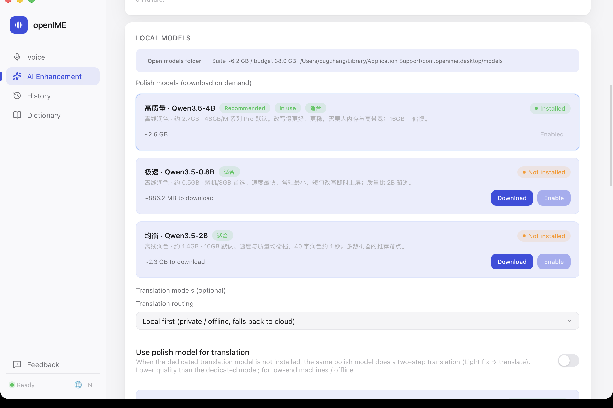
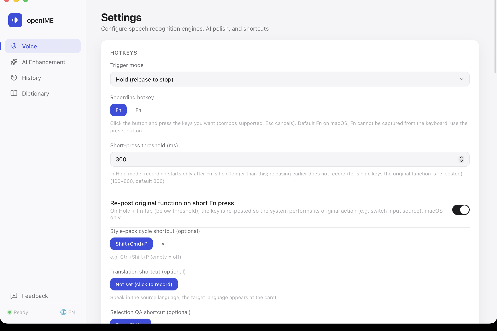

**English** | [简体中文](./README.md)

<p align="center">
  
</p>
<h1 align="center">openIME</h1>
<p align="center">
  An open-source, local-first, cross-platform <strong>voice input method</strong>
</p>
<p align="center">
  Lives in the menu bar. Press a shortcut, speak, and recognized text is typed at your cursor — all on device.
</p>

<p align="center">
  <a href="https://github.com/rhythm1995/openIME/releases">
    
  </a>
  <a href="https://github.com/rhythm1995/openIME/actions/workflows/ci.yml">
    
  </a>
  <a href="https://github.com/rhythm1995/openIME">
    
  </a>
  <a href="https://github.com/rhythm1995/openIME">
    
  </a>
</p>

<br />

---

## Screenshots

<p align="center">
  
</p>

<p align="center">
  
</p>

<p align="center">
  
</p>

---

## Features

### 🎤 Speech-to-text

- **Local-first** — On-device `sherpa-onnx` recognition; audio never leaves your machine. One-click model download with SHA256 verification, resumable transfers, and HF→mirror failover.
- **Switchable engines** — Local sherpa / Bailian WebSocket streaming / OpenAI-compatible REST / Multimodal REST. Engine URLs are auto-normalized (domain, OpenAI-compatible, or DashScope endpoints all work).
- **File transcription** — Audio file → SRT subtitles; long audio auto-segmented with adjustable duration and overlap, plus progress tracking and cancel.

### ✨ AI polish & enhancement

- **L0 rule correction** — Hotword homophone / fuzzy matching, numeral ITN, simplified/traditional Chinese conversion, trailing-punctuation removal.
- **Local LLM polish** — Qwen3.5 by machine tier (0.8B lightweight / 2B balanced / 4B high-end); auto-fallback to Qwen3 on load failure; resident in memory to avoid cold starts.
- **Cloud polish fallback** — OpenAI Chat / Anthropic / Responses (3 protocols); local-first, auto-fallback to cloud on failure, original text passthrough on double failure.
- **Hotword dictionary & style packs** — Custom terms for pronunciation correction; custom system prompts to switch output style with one click.

### 🌐 Translation & QA

- **Speech translation** — Dedicated shortcut: speak the source language, target language is typed at the cursor. 7 base languages out of the box; cloud or a local dedicated translate model (MiLMMT-1B / HY-MT 1.8B) unlocks ~20 extended languages.
- **Selection QA** — Select text and ask questions by voice in a floating panel with streaming answers and multi-turn conversation.
- **Prefix roles** — Lines starting with "邮件:" / "翻译:" / "CMD:" are automatically routed to the matching style pack or provider.

### ⚙️ System-level experience

- **Global shortcut** — Default Fn (🌐 key) with push-to-talk (PTT); toggle mode optional.
- **Insertion fallback** — If simulated typing is swallowed by the target app, falls back to paste (macOS Cmd+V / Windows Ctrl+V) and restores your original clipboard.
- **Short-press repost** — In PTT mode, a short Fn press re-posts the original 🌐 function.
- **Single-instance lock** — Prevents two processes from fighting over shortcut edges.
- **Bilingual UI (CN/EN)** — One-click toggle at the bottom-left. Interface language is fully independent from the ASR recognition language.

### 🖥️ Platform support

- 🍎 **macOS** — Fully supported (menu bar + overlay + system IME integration).
- 🪟 **Windows** — Beta (NSIS packaging, CapsLock single-key recording, insertion fallback verified on real hardware; TSF native commit FFI delivered).

---

## Local Model Suite

The core differentiator: ASR, polish, and translate models **reside together in memory**, auto-tiered by machine.

| Layer | Tier | Model | Resident | Default for |
|---|---|---|---|---|
| ASR | Light | SenseVoice | ~0.7 GB | Low-end / 16GB |
| | Mid | FunASR-Nano int8 | ~1.2 GB | 16GB optional |
| | Heavy | FunASR-Nano fp16 | ~2.0 GB | High-end optional |
| Polish | Fast | Qwen3.5-0.8B | ~0.6 GB | Low-end (can also translate) |
| | Balanced | Qwen3.5-2B | ~1.5 GB | 16GB default |
| | High quality | Qwen3.5-4B | ~2.8 GB | 48GB default |
| Translate | Default | MiLMMT-1B | ~1.1 GB | When budget allows |
| | Optional | HY-MT-1.8B | ~1.4 GB | Terminology / edge |

> The settings page shows the current suite budget bar. On low-end machines, "use polish model as translator" is always available for offline translation.

---

## Quick Start

1. **Install** — Download the macOS `.dmg` or Windows `.exe` from [Releases](https://github.com/rhythm1995/openIME/releases) and install.
2. **Grant permissions** (macOS) — Settings → System Permissions → authorize **Microphone** and **Accessibility**.
3. **Pick an engine** — Local sherpa-onnx is recommended by default (Settings → Recognition engine → Download model); or fill in cloud credentials.
4. **Speak to type** — Press **Fn (🌐)** to start recording, press again to stop; recognized text is typed at the current cursor.

> [!TIP]
> Want an English interface? Click the 🌐 button at the bottom-left to toggle between Chinese and English. The interface language **does not affect** the speech-recognition language — that is set separately under "Recognition engine → Default language".

---

## Architecture

```
┌────────────────────────────────────────────────────────────┐
│           openIME (Tauri v2 · Rust · React 18)             │
├────────────────────────────────────────────────────────────┤
│ UI Layer  React 18 · TypeScript · Vite · CSS Variables     │
│ Settings / History  ──►  Tauri Commands  ──►  Selection QA │
│ Overlay / Menu Bar  ──►  Global Hotkey / Clipboard  ──►  QA│
├────────────────────────────────────────────────────────────┤
│ Bridge  src-tauri  commands / state / QA / perms / TSF     │
├────────────────────────────────────────────────────────────┤
│ Core  voice-core (Rust pure library, zero Tauri deps)      │
│                                                            │
│ ┌────────┐ ─▸┌────────────────────────────┐                │
│ │ Audio  │─▸│ ASR Engine                 │                 │
│ │ (cpal) │   │ local sherpa-onnx          │                │
│ └────────┘   │ cloud Bailian WS · OpenAI  │                │
│             │ Multimodal REST            │                 │
│             └──────────────┬─────────────┘                 │
│                             ▼                              │
│ ┌─────────────────────────────────────┐                    │
│ │ Polish / Translate (Local Suite)    │                    │
│ │ Polish Qwen3.5 (GGUF) · L0 · Cloud  │                    │
│ │ Translate MiLMMT-1B · Prefix Roles  │                    │
│ └──────────────────┬──────────────────┘                    │
│                    ▼                                       │
│ ┌─────────────────────────────────────┐                    │
│ │ TextInserter                        │                    │
│ │ ① enigo  ② Paste Cmd+V/Ctrl+V  ③ TSF│                    │
│ └──────────────────┬──────────────────┘                    │
│                    ▼                                       │
│ ┌─────────────────────────────────────┐                    │
│ │ HistoryStore (SQLite v4)            │                    │
│ └─────────────────────────────────────┘                    │
├────────────────────────────────────────────────────────────┤
│ Tests 476 total  voice-core 345 | frontend 47 | shell 84   │
└────────────────────────────────────────────────────────────┘
```

- **`voice-core`** — All business logic and traits. Four mockable traits form the pipeline, fully testable end-to-end.
- **`polish/`** — L0 rules / cloud 3-protocol / prefix roles / resident GGUF runtime / translate router.
- **`windows_ime/`** — TSF named-pipe protocol + FFI (pure functions with golden fixture tests).
- Full directory layout and design docs in [docs/development.md](docs/development.md).

---

## Development

```bash
pnpm install
pnpm test                  # Frontend (Vitest + React Testing Library, 47 tests)
cargo test -p voice-core   # Core library (345 tests, including 13 integration)
./scripts/build.sh install # Build and install to /Applications
```

| Layer | Test | Count |
|---|---|---|
| voice-core | `cargo test -p voice-core` | 345 |
| Frontend | `pnpm test` | 47 |
| App shell (Windows CI) | `cargo test -p openime` | 84 |
| **Total** | | **476** |

CI: GitHub Actions with four jobs — three-platform core matrix, macOS app shell, Windows app shell, frontend test & build.

Full dev workflow in [docs/development.md](docs/development.md); logs & troubleshooting in [docs/troubleshooting.md](docs/troubleshooting.md).

---

## Documentation

| Document | Description |
|---|---|
| [user-guide.md](docs/user-guide.md) | User guide |
| [development.md](docs/development.md) | Tech stack, architecture, dev workflow |
| [troubleshooting.md](docs/troubleshooting.md) | Logs & FAQ |
| [roadmap.md](docs/roadmap.md) | Requirements backlog & implementation status |
| [local-model-suite.md](docs/local-model-suite.md) | Local model suite design & implementation |
| [windows-porting-notes.md](docs/openIME-windows-porting-notes.md) | Windows porting & packaging |

---

## Roadmap

- ✅ Engines, overlay, tray, global shortcut, onboarding, history details, UI i18n (CN / EN)
- ✅ 3-tier AI polish, hotword dictionary, style packs + prefix roles, translation mode, selection QA, file transcription (long-audio segmentation), simplified/traditional, selection injection, journal export
- ✅ Single-instance lock, ESC interrupt, endpoint SSRF validation, paste fallback + clipboard restore, Fn short-press repost
- ✅ Local model suite (ASR + polish + translate, one-click tiered download), combo tagging, machine-tiered recommendations
- 🔜 Windows TSF native commit (FFI delivered; Win11 per-user requires admin HKLM registration)

> Full requirements backlog with implementation status: [docs/roadmap.md](docs/roadmap.md).

---

## Acknowledgements

- [sherpa-onnx](https://github.com/k2-fsa/sherpa-onnx) — on-device ASR engine
- [Tauri](https://tauri.app/) · [enigo](https://github.com/enigo-rs/enigo) · [cpal](https://github.com/RustAudio/cpal)
- Product form inspired by [AutoGLM](https://xiaonao.io/)

---

<p align="center"><sub>Local-first · Open source · Testable</sub></p>
