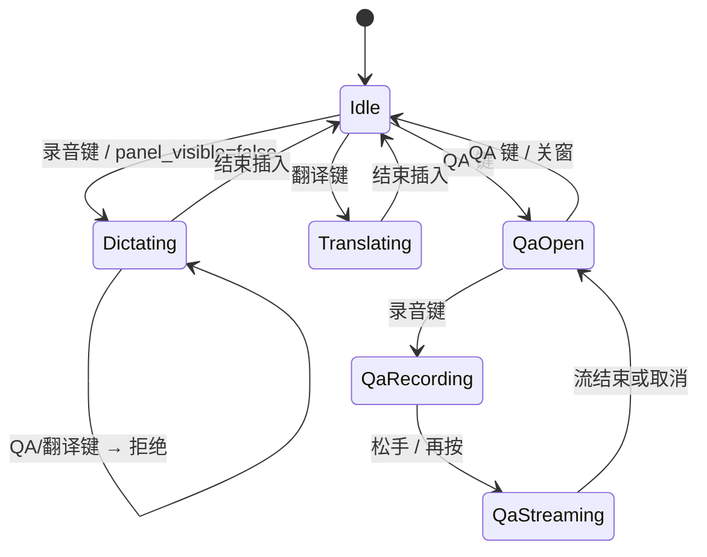
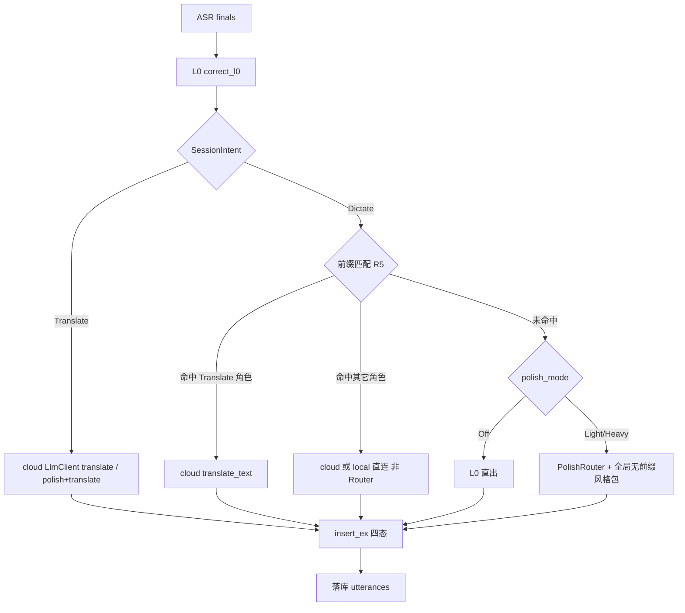
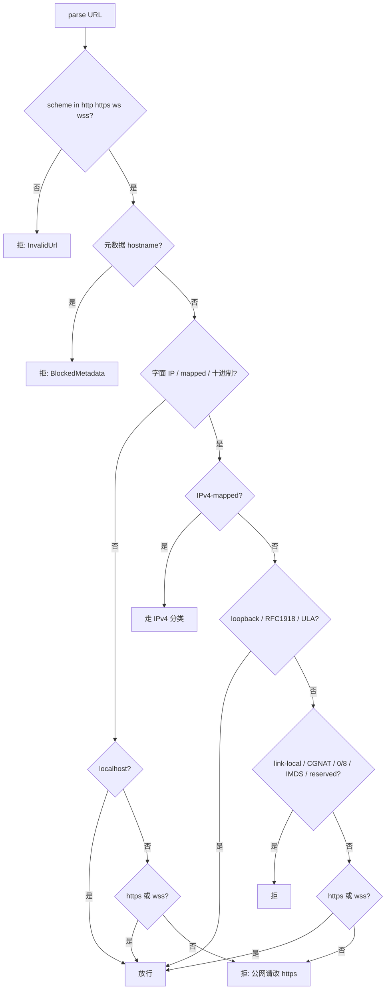
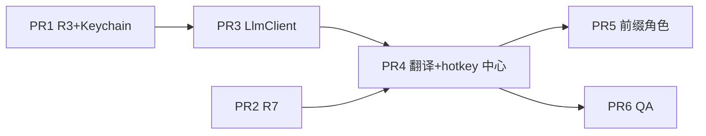

# ⚠️ 已归档：openIME P1 设计（ADR）

> **本文是 P1 需求的完整设计记录（ADR），所有条目（R3–R7）均已实现。**
> 当前实现状态与进度请以 [roadmap.md](./roadmap.md) 为准。本文保留作架构决策追溯。


| 字段 | 值 |
|---|---|
| 文档标题 | openIME P1 需求与技术一体方案 |
| 作者 | openIME 工程 |
| 日期 | 2026-08-13 |
| 状态 | Draft（用户决策已合入） |
| 范围 | roadmap R3 / R4 / R5 / R6 / R7 |
| 受众 | 将按本文实现的工程师（熟悉 `voice-core` + Tauri 薄壳） |

---

## Overview

openIME 已具备「快捷键录音 → ASR → L0 规则 / L2 润色 → enigo 逐字上屏」的完整听写闭环，以及风格包（F1）、选区 AX 直读（F4）、流式 ASR 增量上屏（C1 部分）。P1 要把五件互相咬合的事一次设计清楚，避免做成五套平行子系统：

1. **R3** 用户自填 endpoint 的 SSRF 校验（**保存期字面 host/IP + 请求期禁止 redirect** 的 fail-closed；**不含**请求期 DNS 重解析，那是 P2）。
2. **R4** 独立翻译快捷键：源语言说，光标出目标语言。
3. **R5** 识别结果前缀分流到「角色」——**角色不是新实体，而是带 `match_prefix` 的风格包**。
4. **R6** 划词语音问答浮窗：选区作上下文，多轮流式回答，关窗清空。
5. **R7** enigo 失败时平台粘贴兜底（macOS `Cmd+V` / Windows `Ctrl+V`），并按同一套 restore 状态机恢复用户剪贴板。

本文给出统一的配置增量、会话意图（`SessionIntent`）、插入四态（`Typed` / `Pasted` / `CopiedFallback` / `Failed`）、LLM 调用面，以及可独立 merge 的 PR 切分。工程师应能按「Key Decisions + 各节接口草稿 + PR Plan」直接开工。

---

## Background & Motivation

### 当前状态（与本文相关的事实）

| 能力 | 现状 | 关键代码 |
|---|---|---|
| 配置持久化 | `settings.app_config` JSON；provider `api_key` 已迁 Keychain；**`polish_cloud_api_key` 仍落明文 JSON** | [`src-tauri/src/state.rs`](src-tauri/src/state.rs) `save_config` / `load_config` |
| endpoint 校验 | 仅检查 scheme 前缀（`http(s)://` / `ws(s)://`），**无 host/IP 黑名单** | [`crates/voice-core/src/config.rs`](crates/voice-core/src/config.rs) `ProviderConfig::validate` |
| 润色 | L0 总跑；L2 走 `PolishRouter`（PreferLocal → cloud → 原文）；Heavy 可用风格包替换 system prompt | [`pipeline.rs`](crates/voice-core/src/pipeline.rs) `apply_polish`；[`polish/router.rs`](crates/voice-core/src/polish/router.rs)；[`polish/prompts.rs`](crates/voice-core/src/polish/prompts.rs) |
| 云端 LLM | 一次性 POST，`max_tokens=256`，无翻译 / 无多轮 / 无 SSE；reqwest 默认跟随最多 10 次 redirect | [`polish/cloud.rs`](crates/voice-core/src/polish/cloud.rs) `CloudPolishProvider` |
| 风格包 | `style_packs(id, name, system_prompt, is_builtin, ord)`；仅 Heavy 时渲染列表 + 全局 `active_style_pack_id` | [`store.rs`](crates/voice-core/src/store.rs) v3；[`Settings.tsx`](src/components/Settings.tsx) 388–413 |
| 插入 | `EnigoInserter::insert` 调 `enigo.text`；注释写明「二期再加剪贴板 + Cmd+V」；**无 arboard 依赖** | [`insert.rs`](crates/voice-core/src/insert.rs)；[`voice-core/Cargo.toml`](crates/voice-core/Cargo.toml) |
| 流式上屏 | 仅百炼 `streaming=true` 时 `diff_prefix` 增量 enigo；**不润色、无粘贴回退、不跑 `apply_polish`** | [`commands.rs`](src-tauri/src/commands.rs) `toggle_recording` 840–866 |
| 选区 | macOS `AXSelectedText` 直读，不碰剪贴板；无 Cmd+C sentinel 兜底 | [`app_focus.m`](src-tauri/src/platform/macos/app_focus.m) `openime_get_selection` |
| Windows 焦点 | **无实现**：非 macOS 桩 `frontmost_bundle_id() → None`、`activate_app → false` | [`src-tauri/src/platform/mod.rs`](src-tauri/src/platform/mod.rs) `cfg(not(macos))` |
| 窗口 | `main` + `overlay`（不可聚焦、鼠标穿透 HUD）；capabilities 只放行这两个 label | [`tauri.conf.json`](src-tauri/tauri.conf.json)；[`capabilities/default.json`](src-tauri/capabilities/default.json) |
| 快捷键 | 录音 + 可选风格包循环；`save_app_config` **只在录音键变化时** `apply_hotkey`；`parse_code` 无 `;` | [`lib.rs`](src-tauri/src/lib.rs) `apply_hotkey` / `parse_code` |
| 保存校验 | `save_app_config` 只检查 `active()` 索引；前端 `onSave` 才调 `validateProvider(active)` | [`commands.rs`](src-tauri/src/commands.rs) 73–91；[`Settings.tsx`](src/components/Settings.tsx) 276 |
| `url` crate | **不是** `voice-core` 直接依赖（仅经 reqwest 传递） | workspace `Cargo.toml` |
| `types.ts` | 已落后 Rust：缺 `punct_half_width_apps` / `chinese_script_preference` | 新字段必须同步前端，否则重演 |

### 痛点

- 自托管 ollama / Whisper 合法，但同一输入框也能填 `http://169.254.169.254`，请求会带上 API key。
- 跨语言用户必须先听写再手动翻译；没有「说中文、出英文」的一键路径。
- 风格包是**全局开关**，同一会话无法靠一句话的前缀改走「邮件 / 翻译 / 命令」。
- 选区已能读，但没有问答交互面；overlay 是穿透 HUD，不能当可点选的对话面板。
- 部分 app（安全输入、远程桌面、部分 Electron）吞掉 `enigo.text`；今天没有粘贴兜底。引入粘贴后若不做剪贴板恢复，会制造新的 C2 痛点。

### 竞品锚点（启发，非本仓库源码）

OpenLess / CapsWriter **不在本工作区**。下列语义是实现规范本身；竞品路径仅作灵感来源，工程师不必打开外仓。

**剪贴板恢复状态机（本仓库必须实现的规范）：**

```
PENDING: Mutex<Option<{ id, original, last_inserted }>>
Paste 成功:
  id = next_id()
  original = PENDING.original.unwrap_or(clipboard_before_overwrite)
  last_inserted = text
  spawn 750ms later:
    if PENDING.id != id: return
    if clipboard.get_text() == last_inserted: clipboard.set(original)
    clear if still this id
Type 成功: 不碰 PENDING
```

**前缀检测规范**见 R5（本仓库 `detect_prefix_role`），灵感来自 CapsWriter `startswith` + 剥离冒号，但边界规则以本文为准。

**QA 选区信封**：第一轮 user 消息用 `<selected_text>` XML 包一层，闭标签替换为全角，避免选区文本提前结束信封。

---

## Goals & Non-Goals

### Goals

- 用户自填的 **ASR / 润色 / 翻译 / QA** HTTP(S)/WS(S) endpoint 在保存期做字面 host/IP 校验、请求期禁止 redirect；坏 URL 不落盘，已落盘的清空。
- 独立翻译快捷键：说源语言 → 光标插入目标语言；可选「先润色再翻译」一次调用。
- 听写结果若匹配风格包前缀，按该包处理；与 F1 全局风格包是同一张表。
- 独立 QA 快捷键打开可交互浮窗；抓选区 → 语音提问 → 流式回答 → 多轮；关窗清空。
- 插入路径变为四态；粘贴后延时恢复剪贴板，且用户中途改复制则不覆盖。**P1 同时交付 macOS `Cmd+V` 与 Windows `Ctrl+V`**（同一 Type-then-Paste / `PendingRestore` 状态机）。翻译目标语言 P1 为固定下拉 + BCP-47 映射表，不做自由输入。
- 一套 `AppConfig` 增量 + 一次 SQLite 迁移；快捷键统一注册、冲突在保存时拒绝。

### Non-Goals

- 风格包市场 / JSON 导入导出（R8 / F2）。
- ESC 中断听写润色的完整产品化（R2 / P0；QA 流式取消作为 R6 最小能力单独做）。
- Windows TSF IME（R11）、Linux fcitx5。**不**把 Windows 粘贴兜底排除在外——R7 的 `Ctrl+V` 是 P1。
- Voice Agent、UDP 控制、`.py` 角色热加载。
- 音素模糊热词、短按补发 Fn。
- 把 overlay HUD 改成可点击聊天窗（会破坏「不抢焦点」）。
- 本地 1.5B GGUF 做翻译 / QA 的质量承诺（允许作离线降级，默认不走）。
- **请求期 `lookup_host` + 再 `classify_ip`（DNS 重绑定闭环）——明确列为 P2**，见 R3 边界与 Alternative E。

---

## Key Decisions

1. **角色 = 带前缀的风格包，不新建实体。**  
   在 `style_packs` 上加 `match_prefix` / `provider` / `model` / `role_kind` / `output_mode`。全局 `active_style_pack_id` 仍是「无前缀时 Heavy 用哪套 prompt」。**有 `match_prefix` 的包不进入 `cycle_style_pack`。**

2. **R4 翻译快捷键与 R5「翻译:」前缀共用 `translate_text` 和 `translate_target_lang`。**  
   - 快捷键：`SessionIntent::Translate`，不跑前缀。  
   - 前缀：听写里命中 `role_kind=Translate` 的包 → 同一 `translate_text`。  
   - 「润色+翻译」哨兵合成调用**只挂在 R4**。其它前缀角色用自己的 `system_prompt`，**不**走 `PolishRouter`。

3. **听写前缀匹配发生在 L0 之后、L2 之前；命中则强制走指定 backend 的 LLM，即使 `polish_mode=Off`。**  
   `prefix` / `Translate` / `QA` **永不**调用 `PolishRouter::polish`（避免 PreferLocal 把「邮件:」喂给 1.5B）。无可用 backend → 插入去前缀原文 + `PolishOutcome.warning`。  
   **`prefix_roles_enabled == true` 时，听写强制 `streaming_insert=false`**（否则百炼 C1 路径从不跑 `apply_polish`，A5 无法成立；也不引入「撤销已打出字符」原语）。

4. **QA 用独立 Tauri 窗口 `qa`，不复用 `overlay`。**  
   capabilities 必须加入 `"qa"`。显示：`ActivationPolicy::Regular` + `show` + `set_focus`（**不是** HUD 的 `orderFront`）。关窗且 main 隐藏时恢复 `Accessory`。回答默认只在浮窗；「插入光标」才走 R7。HUD 在 `panel_visible` 时发「问答录音中」文案（OQ2 关闭：要徽章/文案）。

5. **`qa.panel_visible` 时，录音快捷键改走 QA。**  
   QA 的 `frontmost` **只在 `open_qa_panel` 时捕获**，录音键按下不再覆盖（否则前台已是 `com.openime.desktop`，A6.6 会插进 webview）。翻译键在 QA 打开时忽略。听写进行中按 QA 键：拒绝并 toast。

6. **插入默认 Type-then-Paste；P1 同时做 macOS `Cmd+V` 与 Windows `Ctrl+V`。**  
   `enigo.text` 返回 Err 才粘贴；`insert_strategy=Paste` 与 `paste_fallback_apps` 应对「Ok 但吞键」。剪贴板实现放 **Tauri 薄壳**（`insert_fallback.rs` + `arboard`），`voice-core` 只保留 `EnigoInserter` + 纯函数 restore 策略。粘贴和弦按平台分发，**共享** `PendingRestore` / `CLIPBOARD_MU` / 750ms 恢复。Windows 今日无前台进程 API（[`platform/mod.rs`](src-tauri/src/platform/mod.rs) 非 macOS 桩：`frontmost_bundle_id() → None`），PR2 必须补 Win32 前台 exe 匹配，否则 `paste_fallback_apps` 与还焦在 Windows 上是空转。

7. **R3 是「字面 + 禁 redirect」的 fail-closed，不是「含 DNS 重绑定」的 fail-closed。**  
   保存失败整单不落盘；已落盘坏 URL 在 load 清空。所有用户 HTTP 客户端走 `http_client_no_redirect`。请求期 DNS resolve 是 P2。自托管请填字面 RFC1918。

8. **翻译 / QA 只用云端；前缀角色默认云端，仅 `provider=local` 走 GGUF。**  
   Pipeline 持有**分开的** `cloud: Option<Arc<dyn LlmClient>>` 与 `local: Option<Arc<dyn TextPolishProvider>>`，而不是只注入一个 `PolishRouter`。

9. **`LlmClient`：polish / translate / chat_stream；`max_tokens` 按请求传入**（polish 256 / translate·角色 1024 / QA 2048）。  
   `translate_text` / `polish_and_translate` 覆盖全部三种 `PolishCloudProtocol`（复用 `post_json`）。QA SSE 仅 OpenAI Chat。

10. **`apply_hotkey` + 热键互斥检查的所有权在 PR4。**  
    任何 hotkey 字段变化都重新注册；扩展 `parse_code` 支持 `;` 等标点。翻译 / QA 快捷键 **P1 仅 Toggle**（不跟 `HotkeyMode::Hold`）。Fn Hold 只作用于听写录音键，以及 QA 窗可见时的同一录音键。

11. **`polish_cloud_api_key` 在 PR1 迁 Keychain**（username=`polish_cloud`）。角色级 api_key / 自定义 URL 本期不允许。

12. **用户可见警告用结构化结果，不从 `voice-core` emit。**  
    `PolishOutcome { text, warning }` 与 `InsertOutcome` 由 `commands.rs` 映射到 `recording://processing` / `toast://info` / `recording://error`。

---

## 统一架构

### 会话意图与互斥



```rust
#[derive(Debug, Clone, Copy, PartialEq, Eq)]
pub enum SessionIntent {
    Dictate,
    Translate,
    Qa,
}
```

互斥规则（[`lib.rs`](src-tauri/src/lib.rs) `on_hotkey` + [`commands.rs`](src-tauri/src/commands.rs)）：

| 当前状态 | 录音键 | 翻译键 | QA 键 | 风格循环键 |
|---|---|---|---|---|
| Idle | 开始听写 | 开始翻译会话 | 开 QA 窗 | 循环**无前缀**风格包 |
| 听写 / 翻译录音中 | 停止 | 忽略 + toast | 忽略 + toast | 允许（只改下次） |
| QA 窗可见、未录 | 开始 QA 录音 | 忽略 | 关窗清空 | 允许 |
| QA 录音中 | 停止 QA 录音 | 忽略 | 取消并关窗 | 允许 |
| QA 流式中 | 取消流（等同 ESC） | 忽略 | 取消流并关窗 | 允许 |

录音启动继续用现有 `recording_guard` CAS，QA 与听写共享同一把锁。

**`pending_intent` 生命周期：** 快捷键处理函数先做「可否开始」检查（云端 key、未在录音、QA 窗可见性等），**通过之后**才 `store(intent)` 并调用 `toggle_recording`。`toggle_recording` 在 CAS 抢到 guard 后 `take()`；若启动失败（校验、pipeline、麦克风）必须 `take()` 清回 `Dictate`，避免下次录音键变成残留的 Translate。

翻译 / QA 组合键：**只响应 Pressed，忽略 Hold 语义**（再按 = 停）。Fn 录音键在听写 / QA 录音中仍可按现有 `hotkey_mode` 工作。

### `toggle_recording` 分支表（规范）

| intent | `streaming_insert` | 插入光标 | 还焦用的 frontmost | `SessionMeta.engine` | HUD |
|---|---|---|---|---|---|
| `Dictate` | `kind==Bailian && !prefix_roles_enabled` | 是（L0 / 前缀 / Router 之后） | **本次按键前**捕获 | `dictate`（不再写死 `"cloud"`） | 正在聆听 / 正在输入… |
| `Translate` | **false** | 是（translate 之后） | **本次按键前**捕获 | `translate` | 正在翻译… |
| `Qa` | **false** | **否** | **不改** `QaSessionState.frontmost`（开窗时已存） | `qa` | 问答录音中… |

`create_session` 必须用上表的 `engine`，不要沿用今日 `toggle_recording` 里写死的 `"cloud"`。

### 听写 / 翻译文本管线



### QA 管线（不进听写 inserter）

```mermaid
sequenceDiagram
    participant User
    participant Hotkey
    participant QaWin as qa 窗口
    participant Cmd as commands
    participant Sel as get_selection AX
    participant Asr as Pipeline.record_and_collect
    participant Llm as LlmClient.chat_stream
    User->>Hotkey: QA 快捷键
    Hotkey->>Sel: 开窗前抓选区 + frontmost
    Sel-->>Cmd: Option<String>
    Hotkey->>QaWin: Regular+show+focus + qa://state idle
    User->>Hotkey: 录音键
    Note over Hotkey: 不再覆盖 frontmost
    Hotkey->>Asr: intent=Qa, streaming_insert=false
    Asr-->>Cmd: question text
    Cmd->>Llm: ChatRequest + cancel + gen
    loop SSE
        Llm-->>QaWin: qa://delta
    end
    User->>QaWin: 可选「插入光标」
    QaWin->>Cmd: qa_insert_last → 还焦开窗时 frontmost → R7
    User->>Hotkey: 再按 QA / 关窗
    Note over Cmd,QaWin: messages.clear(); hide; 若 main 隐藏则 Accessory
```

### 配置模型（一次增量）

`AppConfig` 新增（全部 `#[serde(default)]`，旧 JSON 可反序列化）：

```rust
// —— R4 翻译 ——
pub translate_hotkey: Option<String>,          // None = 不注册
pub translate_target_lang: String,             // 默认 "en"；BCP-47 短码
pub translate_with_polish: bool,               // 默认 false

// —— R5 ——
pub prefix_roles_enabled: bool,                // 默认 true

// —— R6 ——
pub qa_hotkey: Option<String>,                 // None = 不注册
pub qa_save_history: bool,                     // 默认 false

// —— R7 ——
pub insert_strategy: InsertStrategy,           // 默认 Auto
pub paste_fallback_apps: Vec<String>,
pub restore_clipboard: bool,                   // 默认 true

#[derive(Default, Serialize, Deserialize)]
#[serde(rename_all = "snake_case")]
pub enum InsertStrategy {
    #[default]
    Auto,
    Type,   // serde: "type"
    Paste,
}
```

**字段所有权：** `translate_*` → PR4；`prefix_roles_enabled` → PR5；`qa_*` → PR6；`insert_*` / `paste_*` / `restore_clipboard` → PR2。每个加字段的 PR **必须**同步 `src/types.ts` 与 `src/components/Settings.test.tsx` 的 `defaultConfig`。

建议默认快捷键（**不自动占用**，设置页 placeholder；用户保存后才注册）：

| 功能 | placeholder | 理由 |
|---|---|---|
| 翻译 | `Alt+Shift+T` | 不与 Fn、常见 IDE 冲突 |
| QA | `Cmd+Shift+;` | 对齐 OpenLess 习惯；**PR4 扩展 `parse_code` 才能注册** |
| 风格循环 | 已有 `Ctrl+Shift+P` | 不变 |

`StylePack` 扩展见 R5。`polish_cloud_api_key` 存取改为 Keychain（PR1），JSON 置空。

**保存校验（`save_app_config` 新行为，不是现状）：**

1. `active()` 索引合法（已有）。
2. **每一个非空** `providers[i].base_url` 以及非空 `polish_cloud_endpoint` 走 `validate_endpoint`（百炼见 R3：只验归一化 URL）。**不**因为缺 `api_key` 而拒绝整单保存（用户可能先填地址再填 key；今日前端 `validateProvider` 在云端引擎上会卡 key——PR1 把「URL 校验」放进 save，**不把** `ProviderConfig::validate` 的 key 完备性检查并进 save）。
3. 热键两两不等（PR4 起：含翻译 / QA / 风格 / 录音）。无法 `parse_shortcut` 的非空热键 → 保存失败。
4. 任一项失败 → `Err(String)`，**不写 DB、不改内存 config**。

加载：坏 endpoint 清空并 `log_warn`；`polish_cloud_api_key` 若仍在 JSON 则写入 Keychain 后清空再回写 settings。

---

## R3. endpoint SSRF 校验

### 用户故事

作为填写自托管 Whisper / ollama 的用户，我希望局域网 `http://192.168.x.x:11434` 能用，但误填或被诱导填写云元数据 / 公网明文 HTTP 时，应用拒绝保存并告诉我原因。

### 功能需求

| ID | 需求 |
|---|---|
| FR-3.1 | `validate_endpoint(url) -> Result<(), EndpointError>` 纯函数，无网络 I/O。 |
| FR-3.2 | 拒绝：元数据主机名 `metadata.google.internal`、`metadata.goog`；字面 IPv4 `169.254.169.254`、`169.254.170.2`（ECS）、`100.100.100.200`（阿里云 IMDS）、`168.63.129.16`（Azure IMDS）；`169.254.0.0/16` link-local；`100.64.0.0/10` CGNAT；**整个** `0.0.0.0/8`（`octets()[0]==0`，不是只 `is_unspecified`）；`224.0.0.0/4`；`255.255.255.255`；IPv6 `fe80::/10`、`ff00::/8`、`fd00:ec2::254`。**IPv4-mapped IPv6**（`::ffff:x.x.x.x`）先 `to_ipv4_mapped()` 再走 IPv4 分类。纯十进制主机（`2852039166`）按 `u32` 解成 IPv4 再分类。 |
| FR-3.3 | 放行：`localhost` / `127.0.0.0/8` / `::1`；RFC1918；IPv6 ULA `fc00::/7`。以上允许 http/ws。 |
| FR-3.4 | 其余（公网 IP 或普通 hostname）强制 `https` / `wss`。 |
| FR-3.5 | 调用点见下表。`ProviderKind::Bailian` **只校验** `normalize_ws_url` 之后的 URL（用户常把 `http://…/compatible-mode/v1` 贴进百炼栏，归一化后是同 host 的 `wss://`）。OpenAI/Multimodal REST 与 `polish_cloud_endpoint` 校验用户填写的原始 URL。 |
| FR-3.6 | 抽出 `http_client_no_redirect(timeout) -> reqwest::Client`（`redirect::Policy::none()`），供：`polish/cloud.rs`、`providers/openai_asr.rs`、`providers/multimodal_asr.rs`、以及它们的 `test_connection` / `test_cloud_polish`。百炼 WS：只 `connect_async` 已校验的归一化 `wss://`；不实现自定义 3xx 跟随（tungstenite 连给定 URL；P1 文档化为「不跟随 WS 握手重定向」）。 |
| FR-3.7 | 空字符串 =「用默认」，不校验。 |

### 非功能

| ID | 需求 |
|---|---|
| NFR-3.1 | 纯函数，`cargo test -p voice-core` 表驱动 ≥ 20 case（含 mapped IPv6），不碰网络。 |
| NFR-3.2 | 保存被拒时 Settings 红字展示 `EndpointError` Display（中文）。 |
| NFR-3.3 | PR1 把 `url = "2"` 加进 `voice-core` **直接**依赖。IP 辅助函数必须在 rustc **1.75** 下编译：不要用 `Ipv4Addr::is_shared` / `Ipv6Addr::is_unicast_link_local` / `is_unique_local`（1.84+）。 |

### 验收（可复现）

| # | 操作 | 期望 |
|---|---|---|
| A3.1 | 润色 endpoint 填 `http://169.254.169.254/` 保存 | 失败，文案含元数据或 link-local；刷新后仍是旧值 |
| A3.2 | ASR **OpenAI 兼容**填 `http://192.168.1.20:8080/v1` 保存 | 成功 |
| A3.3 | **润色或 OpenAI REST** 填 `http://openai.com/v1` 保存 | 失败，文案含「https」 |
| A3.4 | 润色填 `https://dashscope.aliyuncs.com/compatible-mode/v1` | 成功 |
| A3.5 | 填 `http://localhost:11434/v1` | 成功 |
| A3.6 | 填 `http://100.64.1.1:80` | 失败（CGNAT） |
| A3.7 | 手工把 DB 里写成元数据 URL 后启动 | load 清空该字段；日志 warn |
| A3.8 | **百炼栏**填 `https://evil.example/compatible-mode/v1` | 归一化为 `wss://evil.example/…` → 保存成功（公网 wss） |
| A3.9 | **百炼栏**填 `http://dashscope.aliyuncs.com/compatible-mode/v1` | 归一化同 host 的 `wss://` → **保存成功**（不得因原始 http 拒绝） |
| A3.10 | 润色填 `https://[::ffff:169.254.169.254]/` 或 `https://0.0.0.1/` 或 `http://100.100.100.200/` | 失败 |

### 接入点

| 位置 | 改动 |
|---|---|
| **新** `crates/voice-core/src/endpoint.rs` | `validate_endpoint` / helpers / 表驱动测试 |
| **新** `crates/voice-core/src/http.rs` | `http_client_no_redirect` |
| `crates/voice-core/Cargo.toml` | `url = "2"` |
| `config.rs` `ProviderConfig::validate` | 非空 URL：Bailian 只验 `normalize_ws_url`；REST 验原文 |
| `providers/bailian.rs` | 连接前再验归一化 URL |
| `providers/openai_asr.rs` / `multimodal_asr.rs` | 请求与 `test_connection` 用无 redirect 客户端 |
| `polish/cloud.rs` `post_json` | 同上 |
| `src-tauri/src/commands.rs` `save_app_config` | 所有非空用户 URL；**不**强制 api_key |
| `src-tauri/src/state.rs` `load_config` / `save_config` | 坏 URL 清空；**polish_cloud Keychain 迁移** |
| `src-tauri/src/credentials.rs` | `store_polish_key` / `fetch_polish_key`（username=`polish_cloud`） |

### 算法

```rust
pub fn validate_endpoint(raw: &str) -> Result<(), EndpointError> { /* 见下 */ }

/// rustc 1.75 兼容辅助，禁止调用 1.84 标准库同名方法。
fn is_cgnat(v: Ipv4Addr) -> bool {
    let o = v.octets();
    o[0] == 100 && (o[1] & 0xc0) == 64          // 100.64.0.0/10
}
fn is_ula(v: Ipv6Addr) -> bool {
    (v.segments()[0] & 0xfe00) == 0xfc00        // fc00::/7
}
fn is_unicast_link_local_v6(v: Ipv6Addr) -> bool {
    (v.segments()[0] & 0xffc0) == 0xfe80        // fe80::/10
}
fn is_ipv4_this_net(v: Ipv4Addr) -> bool {
    v.octets()[0] == 0                          // 0.0.0.0/8
}

const ALIYUN_IMDS: Ipv4Addr = Ipv4Addr::new(100, 100, 100, 200);
const AZURE_IMDS: Ipv4Addr = Ipv4Addr::new(168, 63, 129, 16);
const ECS_IMDS: Ipv4Addr = Ipv4Addr::new(169, 254, 170, 2);
const EC2_V4: Ipv4Addr = Ipv4Addr::new(169, 254, 169, 254);

fn classify_ip(ip: IpAddr, scheme: &str) -> Result<(), EndpointError> {
    let v4 = match ip {
        IpAddr::V4(v) => v,
        IpAddr::V6(v) => {
            if let Some(mapped) = v.to_ipv4_mapped() {
                return classify_ip(IpAddr::V4(mapped), scheme);
            }
            if v.segments() == [0xfd00, 0xec2, 0, 0, 0, 0, 0, 0x254] {
                return Err(EndpointError::BlockedMetadata);
            }
            if is_unicast_link_local_v6(v) { return Err(EndpointError::BlockedLinkLocal); }
            if v.is_multicast() || v.is_unspecified() { return Err(EndpointError::BlockedReserved); }
            if v.is_loopback() || is_ula(v) { return Ok(()); }
            return require_tls(scheme, ip);
        }
    };
    if v4 == EC2_V4 || v4 == ECS_IMDS || v4 == ALIYUN_IMDS || v4 == AZURE_IMDS {
        return Err(EndpointError::BlockedMetadata);
    }
    if v4.is_link_local() { return Err(EndpointError::BlockedLinkLocal); }
    if is_cgnat(v4) { return Err(EndpointError::BlockedCgnat); }
    if is_ipv4_this_net(v4) || v4.is_broadcast() || v4.is_multicast() {
        return Err(EndpointError::BlockedReserved);
    }
    if v4.is_loopback() || v4.is_private() { return Ok(()); }
    require_tls(scheme, ip)
}

fn parse_host_ip(host: &str) -> Option<IpAddr> {
    if let Ok(ip) = host.parse::<IpAddr>() { return Some(ip); }
    // 纯十进制 IPv4（如 2852039166）
    if let Ok(n) = host.parse::<u32>() {
        return Some(IpAddr::V4(Ipv4Addr::from(n)));
    }
    None
}
```

决策树（IPv6 mapped 在「字面 IP」节点先展开为 v4）：



### 错误与边界

| 边界 | 行为 |
|---|---|
| IPv6 `::1`、`[::1]:11434` | loopback 放行 |
| `https://[::ffff:169.254.169.254]/` | mapped → IPv4 元数据 → 拒 |
| `https://[::ffff:192.168.1.1]/` | mapped → RFC1918 → 放行 |
| `https://0.0.0.1/` | `0.0.0.0/8` → 拒 |
| `http://100.100.100.200/` | 阿里 IMDS → 拒（即便落在 CGNAT 之外的精确地址） |
| `http://192.168.1.1.nip.io` | 公网 hostname + http → 拒 |
| `https://attacker.example` 日后重绑到 169.254 | **P1 不拦**。P2：请求期 `lookup_host` + `classify_ip`。P1 缓解：字面 + 禁 redirect + 自托管用字面 RFC1918 |
| 保存期不 DNS | 避免离线/CI 误杀 |
| 百炼原始 `http://公网host/...` | **不**对原文做公网 http 拒绝；只验 `wss://同一host/...` |
| 已保存坏 URL | load 清空；请求期再验 |

---

## R4. 翻译模式

### 用户故事

作为需要中英切换写文档的用户，我按下翻译快捷键说中文，光标处直接出现英文；在设置里把目标语言改成日文后，下次按同一快捷键出日文。

### 功能需求

| ID | 需求 |
|---|---|
| FR-4.1 | 设置页：翻译快捷键、**固定**目标语言下拉（闭集，无自由输入）、勾选「先润色再翻译」。短码→prompt 名见下表。 |
| FR-4.2 | `SessionIntent::Translate`：同一套录音 / HUD / 还焦；不走风格包、不走前缀、不走 `PolishRouter`。 |
| FR-4.3 | `cloud.as_ref().translate_text(...)`；失败回退 L0 原文（不丢字），`PolishOutcome.warning = TranslateFailed`，HUD「翻译失败，已插入原文」。 |
| FR-4.4 | `translate_with_polish=true`：哨兵 `[[OPENIME_POLISHED_SOURCE]]` / `[[OPENIME_TRANSLATION]]`。解析失败 → 纯 `translate_text`；再失败 → L0 原文。 |
| FR-4.5 | 只用云端。无 key → **在写入 `pending_intent` 之前** toast「请先配置云端 LLM」，不开始录音。 |
| FR-4.6 | 目标语言下次会话生效。 |
| FR-4.7 | 结果走 `insert_ex`；`SessionMeta.engine = "translate"`。 |
| FR-4.8 | `streaming_insert=false`。 |
| FR-4.9 | `translate_text` / `polish_and_translate` 实现 **三种** `PolishCloudProtocol`（均走 `post_json`）。 |

目标语言闭集（`prompts.rs`）：

| 短码 | prompt 用名 |
|---|---|
| `zh` | 中文 |
| `en`、`en-US` | English |
| `ja` | 日本語 |
| `ko` | 한국어 |
| `fr` | français |
| `de` | Deutsch |
| `es` | español |

未知短码：原样传入 prompt（防御），UI 不下发未知值。**P1 不做自由输入目标语言。**

> **注（后续扩展）**：上述「固定 7 语闭集」为 P1 范围；本地三件套（`f43012f`）已将目标语言扩展为「基础 7 语 + 扩展集」分档（启用云端或本地专翻 MiLMMT-46 / HY-MT 解锁扩展集），见 [`local-model-suite.md`](./local-model-suite.md)。本文件为 P1 设计存档，保留原文不改。

### 非功能

| ID | 需求 |
|---|---|
| NFR-4.1 | 翻译超时 `max(polish_timeout_ms, 8000)`。 |
| NFR-4.2 | `max_tokens=1024`（请求字段，不是写死在 `post_json`）。 |
| NFR-4.3 | prompt / 哨兵 / 短码映射纯函数单测。 |

### 验收

| # | 类型 | 操作 | 期望 |
|---|---|---|---|
| A4.1 | **手工** | 真模型，目标 English，说「明天开会」 | 光标为英文 |
| A4.2 | **手工** | 目标 日本語 | 日文 |
| A4.3 | 自动 | 无 key 按翻译键 | 不录音，toast；`pending_intent` 仍为 Dictate |
| A4.4 | **手工** | 润色+翻译 + 口头禅 | 译文无口头禅；无哨兵残片 |
| A4.4b | 自动 | mock `LlmClient` 返回固定译文 / 缺标记再走纯翻译 | pipeline 插入 mock 文本；缺标记触发第二次调用 |
| A4.5 | 自动 | 翻译键 == 录音键 保存 | 失败 |

### 接入点

见统一架构分支表。`lib.rs` 注册翻译键（PR4 同时收口 `apply_hotkey`）。`App.tsx` 增加 `toast://info` 监听（PR4）。

### 接口草稿

```rust
#[async_trait]
pub trait LlmClient: Send + Sync {
    async fn polish(&self, req: PolishRequest) -> Result<PolishResponse>;
    async fn translate_text(&self, req: TranslateRequest) -> Result<String>;
    async fn polish_and_translate(&self, req: TranslateRequest) -> Result<PolishTranslate>;
    async fn chat_stream(&self, req: ChatRequest) -> Result<String>;
}

pub struct TranslateRequest {
    pub text: String,
    pub target_lang: String, // 已是「English」等，调用方先 `lang_display_name`
    pub timeout: Duration,
    pub max_tokens: u32,
}

pub struct ChatRequest {
    pub messages: Vec<(String, String)>,
    pub timeout: Duration,
    pub max_tokens: u32,
    pub cancel: Arc<AtomicBool>,
    pub gen: u64,
    pub on_delta: Box<dyn Fn(&str) + Send>,
}

pub struct PolishOutcome {
    pub text: String,
    pub warning: Option<PolishWarn>,
}
pub enum PolishWarn {
    TranslateFailed,
    RoleLlmFailed,
    RoleNoBackend,
}

pub fn lang_display_name(code: &str) -> &str { /* 上表 */ }
```

---

## R5. LLM 前缀角色（指令路由）

### 用户故事

我说「邮件: 明天三点会议室见」得到正式邮件正文；下一句「翻译: hello」得到译文——不必先切风格包。

### 与 F1 风格包的关系

| | 全局风格包（F1） | 前缀角色（R5） |
|---|---|---|
| 存储 | **同一张** `style_packs` | 同左 |
| 触发 | `active_style_pack_id` + Heavy | L0 后 `match_prefix` |
| 优先级 | 无前缀时生效 | **高于**全局风格包 |
| 循环快捷键 | **仅** `match_prefix` 为空的包 | **排除** |
| UI | 「角色 / 风格包」卡片，**不**再藏在 Heavy 里 | 同左，每行可编辑前缀 / prompt / provider |

**`prefix_roles_enabled == true` ⇒ 听写 `streaming_insert=false`。** 关闭前缀角色后，百炼 C1 恢复。不实现「先打出再撤销」。

迁移：

- v4 `ALTER TABLE` 加列。旧行 `match_prefix=NULL`、`role_kind='default'` → 与今日一致。
- `seed_builtin_prefix_packs_if_missing`：按 id 补缺失项。
- **内置包不可删**（沿用 `DELETE … AND is_builtin=0`）。用户厌恶种子：把 `match_prefix` 清空即可。可改前缀 / prompt。

### 功能需求

| ID | 需求 |
|---|---|
| FR-5.1 | `StylePack` 增：`match_prefix: Option<String>`、`provider: Option<String>`（`None`=cloud、`cloud`、`local`）、`model: Option<String>`、`role_kind: RoleKind`（`Default` \| `Translate`）、`output_mode`（P1 仅 `Insert`，预留 `Panel`）。 |
| FR-5.2 | **唯一规范** `detect_prefix_role`：最长别名 + `prefix_boundary_ok` + 去前缀后正文非空。见下方函数，删除任何其它表述。 |
| FR-5.3 | 听写 L0 后调用。命中后直连 `cloud` 或 `local`，**禁止** `PolishRouter`。失败 → 去前缀原文 + `RoleLlmFailed` / `RoleNoBackend`。 |
| FR-5.4 | `role_kind == Translate` → `translate_text(..., translate_target_lang)`。**禁止**用 id/name 子串猜。种子 `builtin-role-translate.role_kind=Translate`。 |
| FR-5.5 | 命中时跳过「≤8 字不跑 L2」。 |
| FR-5.6 | 无前缀 → Off=L0；Light/Heavy=`PolishRouter` + **无前缀**全局包。 |
| FR-5.7 | 「角色 / 风格包」卡片在 Off/Light/Heavy 都可见（或至少 `prefix_roles_enabled` 时可见）。每包可就地编辑前缀 / prompt / provider；徽章「前缀: 邮件」。 |
| FR-5.8 | upsert 拒绝相同别名；检测期等长冲突取更小 `ord`。 |
| FR-5.9 | `SessionIntent::Translate` 不跑前缀。 |
| FR-5.10 | `prefix_roles_enabled` 时听写关闭流式上屏。 |

### 非功能

| ID | 需求 |
|---|---|
| NFR-5.1 | 检测纯函数覆盖：中英冒号、空格、`MAIL:`、`翻译家`、空正文、最长前缀、`prefix_roles_enabled=false`。 |
| NFR-5.2 | 角色 LLM `max_tokens=1024`，超时同翻译。 |

### 验收

| # | 类型 | 操作 | 期望 |
|---|---|---|---|
| A5.1 | **手工** | 真模型「邮件: 明天开会」 | 正式邮件体，无前缀 |
| A5.1b | 自动 | mock 返回固定邮件体 | 插入 mock，前缀已剥 |
| A5.2 | **手工** | 「翻译: hello」目标中文 | 中文译文 |
| A5.2b | 自动 | `role_kind=Translate` + mock translate | 走 `translate_text` 而非 polish |
| A5.3 | 自动 | 「翻译：hello」 | 与 A5.2b 同一检测结果 |
| A5.4 | 自动 | 无前缀 | 不调角色 |
| A5.5 | 自动 | `polish_mode=Off` + 前缀 | 仍调角色 cloud |
| A5.6 | 自动 | 无 backend | 插入去前缀原文 + warning |
| A5.7 | 自动 | 关前缀开关 | 「邮件: …」当普通文本 |
| A5.8 | 自动 | 百炼 + 前缀开 | `streaming_insert==false` |

### 接入点

| 位置 | 改动 |
|---|---|
| `store.rs` | v4；`role_kind`；seed；内置不可删 |
| `polish/roles.rs` | **唯一**检测实现 |
| `pipeline.rs` | 前缀分支直连 cloud/local |
| `state.rs` | 分开的 cloud/local handles + packs |
| `lib.rs` `cycle_style_pack` | `filter(|p| p.match_prefix.is_none())` |
| `Settings.tsx` | 卡片移出 Heavy-only；就地编辑 |

### 检测函数（规范全文，以代码为准）

```rust
/// 最长别名匹配。
///
/// 边界：别名之后必须是串尾，或分隔符 `：:，,。. ` 之一。
/// 「翻译家在开会」不匹配「翻译」。
/// 剥离分隔符后正文为空（只说了「邮件」/「邮件:」）→ None。
pub fn detect_prefix_role<'a>(text: &str, packs: &'a [StylePack]) -> Option<(&'a StylePack, String)> {
    let t = text.trim();
    let mut best: Option<(&StylePack, usize)> = None;
    for p in packs {
        let Some(spec) = p.match_prefix.as_deref() else { continue };
        for alias in spec.split('|').map(str::trim).filter(|s| !s.is_empty()) {
            if !starts_with_ignore_case(t, alias) { continue; }
            let rest: String = t.chars().skip(alias.chars().count()).collect();
            if !prefix_boundary_ok(&rest) { continue; }
            let n = alias.chars().count();
            let better = match best {
                None => true,
                Some((_, k)) if n > k => true,
                Some((bp, k)) if n == k && p.ord < bp.ord => true,
                _ => false,
            };
            if better { best = Some((p, n)); }
        }
    }
    let (pack, n) = best?;
    let rest: String = t.chars().skip(n).collect();
    let rest = rest
        .trim_start_matches(|c: char| matches!(c, '：' | ':' | '，' | ',' | '。' | '.' | ' '))
        .trim();
    if rest.is_empty() { return None; }
    Some((pack, rest.to_string()))
}

fn prefix_boundary_ok(rest: &str) -> bool {
    match rest.chars().next() {
        None => true,
        Some(c) => matches!(c, '：' | ':' | '，' | ',' | '。' | '.' | ' '),
    }
}
```

### 错误与边界

| 边界 | 行为 |
|---|---|
| 只说「邮件」或「邮件:」 | 不触发 |
| 「翻译家在开会」 | 不触发 |
| 「邮件: 翻译: hi」 | 只剥最左最长一次 |
| 清空内置包前缀 | 退回纯风格包，且重新进入循环列表 |
| `provider=local` 但未装 GGUF | `RoleNoBackend` |

---

## R6. 划词语音问答（QA 面板）

### 用户故事

选中一段函数，按 QA 键，问「这段什么意思」，答案在浮窗流式出现；再追问；关窗后再开，上下文已清空。

### 功能需求

| ID | 需求 |
|---|---|
| FR-6.1 | 窗口 label=`qa`，`index.html#qa`，400×520，`alwaysOnTop`，系统标题栏 + 关闭钮，**可聚焦**。默认位置：指针所在屏右下角，距边 **24px**；之后记住上次位置。 |
| FR-6.2 | QA 键 toggle。**显示前** `get_selection()` + 捕获 `frontmost`。选区 >4000 字取首 2000+尾 2000。信封 `sanitize` 使用**同一截断结果**，不再 `take(16_000)`。 |
| FR-6.3 | 空选区可开窗，预览「未检测到选区」。 |
| FR-6.4 | 窗可见时录音键 = QA 录音，`streaming_insert=false`。HUD「问答录音中…」。 |
| FR-6.5 | `chat_stream`；`qa://delta`。 |
| FR-6.6 | `messages` 累加；关窗清空。发送前只保留 **最近 8 轮**（16 条）或累计 user+assistant 字符 ≤ 8000（先到为准）。 |
| FR-6.7 | 第一轮：`<selected_text>` 信封 + 问题。后续轮不重复塞选区，除非「刷新选区」。 |
| FR-6.8 | 不自动插入。「复制」「插入光标」「刷新选区」。 |
| FR-6.9 | 无云端 key：横幅；录音键 toast 且不录。 |
| FR-6.10 | ESC / 流式中再按录音键 / QA 键：`ChatRequest.cancel=true` 并 bump `gen`；保留已输出。 |
| FR-6.11 | `qa_save_history=false`：不写库。`true`：面板**每次打开**建一条 `sessions`（`engine=qa`）；每一轮问答写 **两条** `utterances`（`Q: …` / `A: …`），`seq` 递增。 |
| FR-6.12 | 互斥见表。 |
| FR-6.13 | `src-tauri/capabilities/default.json` 的 `windows` 加入 `"qa"`。 |

### 非功能

| ID | 需求 |
|---|---|
| NFR-6.1 | **显示前**读 AX。`show_qa_window`：`set_activation_policy(Regular)` + `show` + `set_focus`。不要用 overlay 的 `orderFront` / `ignore_cursor_events`。关窗：`close_qa_panel`；若 main 不可见则 `Accessory`。 |
| NFR-6.2 | 流式超时 60s；`max_tokens=2048`。 |
| NFR-6.3 | `CloseRequested` → `close_qa_panel`，禁止只 hide 留 messages。 |

### 验收

| # | 类型 | 期望 |
|---|---|---|
| A6.1 | **手工** | 浮窗流式解释；文档选区仍在；光标无插入 |
| A6.1b | 自动 | mock SSE fixture 推两条 delta，前端/状态机拼出全文 |
| A6.2 | 自动 | 第二轮 messages 含第一轮 |
| A6.3 | 自动 | 关窗 `messages` 空 |
| A6.4 | 自动 | 听写中 QA 键不开窗 |
| A6.5 | 自动 | QA 录音不调用 `insert_ex` |
| A6.6 | 自动 / 手工 | 插入使用**开窗时** frontmost，不是 QA webview |
| A6.7 | 自动 | cancel 后不再接受该 gen 的 delta |

### 接入点

| 位置 | 改动 |
|---|---|
| `tauri.conf.json` | `qa` 窗 |
| `capabilities/default.json` | `"qa"` |
| `src/main.tsx` / **新** `QaPanel.tsx` | `#qa` |
| **新** `src-tauri/src/qa.rs` | 状态机 |
| `lib.rs` | `show_qa_window` / `close_qa_panel`；**不改写** PR4 的 `apply_hotkey`，只加 `qa_hotkey` 注册项 |
| `commands.rs` | 按分支表走 `intent=Qa` |

### 状态机

```rust
enum QaPhase { Hidden, Idle, Recording, Transcribing, Streaming }

struct QaSessionState {
    phase: QaPhase,
    panel_visible: bool,
    selection: Option<String>,
    frontmost: Option<String>, // 仅 open_qa_panel 写入
    messages: Vec<QaMessage>,
    stream_cancel: Arc<AtomicBool>,
    session_gen: u64,
}
```

---

## R7. 粘贴兜底 + 剪贴板恢复

### 用户故事

在不接受模拟按键的远程桌面里，文字仍能上屏；事先复制的内容约 0.75s 后回到剪贴板。若这期间我又复制了别的，应用不得覆盖。

### 功能需求

| ID | 需求 |
|---|---|
| FR-7.1 | `arboard` 加在 **`src-tauri`**，**不加** `voice-core`。 |
| FR-7.2 | `TextInserter::insert` 保持尽力插入。薄壳 `CompositeInserter::insert_ex(text, opts) -> InsertOutcome`。 |
| FR-7.3 | `Auto`：enigo `Err` → 粘贴。`Type`：只 enigo。`Paste`：只粘贴。serde：`auto` / `type` / `paste`。 |
| FR-7.4 | `paste_fallback_apps` 命中当前前台标识 → 视同 `Paste`。匹配见下「前台标识」。 |
| FR-7.5 | 粘贴：持 `CLIPBOARD_MU` → 读原文本 → 写插入文字 → **平台粘贴和弦**（macOS `Cmd+V` / Windows `Ctrl+V`）→ `schedule_restore(750ms)`。两端同一延迟、同一 `PendingRestore`。 |
| FR-7.6 | 恢复前 `get_text()==last_inserted` 才写回 `original`。 |
| FR-7.7 | 见下方 `PendingRestore`。**Type 成功不碰 PENDING**（不取消进行中的上次 Paste 恢复）。 |
| FR-7.8 | 粘贴模拟失败：文字留在剪贴板，`CopiedFallback`，不恢复；`commands` → HUD「已复制，请手动粘贴」。 |
| FR-7.9 | 剪贴板与 enigo 都失败 → `Failed` → `recording://error`。 |
| FR-7.10 | 听写 / 翻译 / QA 插入走 `insert_ex`。流式 chunk `enigo` 失败：对 `diff_prefix(already_typed, full_final)` **粘贴一次**，停止继续逐字。`prefix_roles_enabled` 时听写根本不走流式（R5），本条只服务前缀关闭时的百炼 C1。 |

`insert_finals_*` 增加独立参数 `insert_opts: InsertOpts`，**不要**塞进 `PolishContext`。

### 非功能

| ID | 需求 |
|---|---|
| NFR-7.1 | restore 纯函数可单测。 |
| NFR-7.2 | 恢复线程 panic 不影响录音。 |
| NFR-7.3 | CI 不测真实系统粘贴。平台单测：`paste_chord()` 在 `cfg(macos)` 断言 Meta+V，`cfg(windows)` 断言 Control+V。剪贴板线程见下。 |

### 验收

| # | 期望 |
|---|---|
| A7.1 | Auto + 普通文本框：Typed，剪贴板不变 |
| A7.2 | Paste + `SECRET` → `HELLO`：≈750ms 后剪贴板 `SECRET`（macOS 与 Windows 均测） |
| A7.3 | 200ms 内用户复制 `OTHER`：不覆盖 |
| A7.4 | 连续两句 Paste：最终 original 是第一次之前的内容 |
| A7.5 | mock enigo 失败 → Pasted 或 CopiedFallback |
| A7.6 | 翻译 / QA 插入同一套四态 |
| A7.7 | 单元：`paste_chord` macOS=Cmd+V、Windows=Ctrl+V；`paste_fallback_apps` 对 `mstsc.exe` 命中 `mstsc` |

### 拆分（唯一方案，无平行设计）

- `voice-core`：`EnigoInserter` 只打字；`InsertOutcome`；`should_restore_clipboard`；`remember_pending` 纯逻辑可测。**不加** `arboard`。
- `src-tauri/src/insert_fallback.rs`：`ClipboardInserter`（`arboard` + 平台粘贴和弦）+ 进程级状态机。macOS / Windows **共用**下列结构：

```rust
struct PendingRestore {
    id: u64,
    original: Option<String>,
    last_inserted: String,
}
static PENDING: Mutex<Option<PendingRestore>> = ...;
static CLIPBOARD_MU: Mutex<()> = ...; // get/set 与 restore 互斥，避免 restore_1.set 插在 insert_2.get/set 之间
```

### 平台粘贴和弦与前台标识（PR2 必须两端都落地）

今日仓库 **没有** Windows 焦点实现：[`src-tauri/src/platform/mod.rs`](src-tauri/src/platform/mod.rs) 在 `#[cfg(not(target_os = "macos"))]` 下 `fn_key::frontmost_bundle_id() → None`、`activate_app → false`。macOS 真身在 [`fn_key.rs`](src-tauri/src/platform/macos/fn_key.rs) + [`app_focus.m`](src-tauri/src/platform/macos/app_focus.m)（`NSWorkspace.frontmostApplication.bundleIdentifier`）。`restore_frontmost_focus`（[`commands.rs`](src-tauri/src/commands.rs) 693）把该字符串交给 `activate_app`。

| 点 | macOS | Windows（P1 新增） |
|---|---|---|
| 前台标识 | bundle id，如 `com.microsoft.rdc.macos` | 进程 exe **basename**（小写），如 `mstsc.exe` |
| 捕获 API | 已有 `openime_frontmost_bundle_id` | **新** [`src-tauri/src/platform/windows/focus.rs`](src-tauri/src/platform/windows/focus.rs)：`GetForegroundWindow` → `GetWindowThreadProcessId` → `OpenProcess` + `QueryFullProcessImageNameW` → 取文件名 |
| `paste_fallback_apps` | `frontmost.contains(kw)`（与现有 `punct_half_width_apps` 一样） | 不区分大小写：`exe == kw` 或 `exe == kw+".exe"` 或 `exe.contains(kw)` |
| 还焦 | 已有 `openime_activate_app(bundle_id)` | 同文件 `activate_app`：枚举顶层窗，pid→exe 命中则 `SetForegroundWindow` |
| 粘贴和弦 | CGEvent：`kVK_ANSI_V=9` + `kCGEventFlagMaskCommand`（Cmd+V） | `SendInput`：`VK_CONTROL` down → `VK_V` down/up → `VK_CONTROL` up（**Ctrl+V**，不是 Meta）。亦可用 enigo `Key::Control` + `Unicode('v')`，须 Press/Click/Release 成对，失败时反向释放防卡键 |
| `arboard` | 只在 `src-tauri` | 只在 `src-tauri`（同一 crate，双平台） |
| 剪贴板线程 | NSPasteboard 历史上要主线程；`get/set` 走已有 `run_on_main_sync`（[`commands.rs`](src-tauri/src/commands.rs) 672）。PR2 先实测，失败则强制主线程 | Win32 `OpenClipboard` **通常任意线程可用**，但同一进程同时只能开一次。全部 get/set/restore 串在 `CLIPBOARD_MU` 后。**禁止**从窗口过程 / 快捷键回调重入时直接 `OpenClipboard`（先 `spawn` 或排队）。`OpenClipboard` 失败（被其它进程占用）重试 1～2 次、间隔 ~20ms，仍失败则 `CopiedFallback` 路径不可用 → `Failed` |
| 恢复延迟 | 750ms | **同一** 750ms |
| 标识写入 `InsertOpts.frontmost` | bundle id | exe basename（同一 `Option<&str>` 字段，平台各自填充） |

```rust
// insert_fallback.rs
fn simulate_paste() -> Result<(), String> {
    #[cfg(target_os = "macos")]
    { macos_cmd_v() }           // CGEvent Cmd+V
    #[cfg(target_os = "windows")]
    { windows_ctrl_v() }        // SendInput Ctrl+V
    #[cfg(not(any(target_os = "macos", target_os = "windows")))]
    { Err("unsupported platform".into()) }
}

fn clipboard_set_text(text: &str) -> Result<(), String> {
    let _g = CLIPBOARD_MU.lock();
    #[cfg(target_os = "macos")]
    { /* arboard；必要时 run_on_main_sync */ }
    #[cfg(target_os = "windows")]
    { /* arboard 直接调用；OpenClipboard 失败则短重试 */ }
}
```

Windows 焦点模块草图（替换非 macOS 桩，不要再让 `frontmost_bundle_id` 在 Windows 上恒 `None`）：

```rust
// src-tauri/src/platform/windows/focus.rs
pub fn frontmost_exe_basename() -> Option<String> { /* GetForegroundWindow … */ }
pub fn activate_by_exe_basename(exe: &str) -> bool { /* EnumWindows + SetForegroundWindow */ }

// platform/mod.rs
#[cfg(target_os = "windows")]
pub mod windows;
#[cfg(target_os = "windows")]
pub use windows as current;
// current::fn_key::frontmost_bundle_id 在 Windows 上转发 frontmost_exe_basename，
// 避免改 toggle_recording 的字符串管道。
```

`src-tauri/Cargo.toml` 增加：

```toml
[target.'cfg(target_os = "windows")'.dependencies]
windows = { version = "0.58", features = [
  "Win32_Foundation",
  "Win32_UI_WindowsAndMessaging",
  "Win32_UI_Input_KeyboardAndMouse",
  "Win32_System_Threading",
  "Win32_System_ProcessStatus",
] }
```

`arboard` 放在 `src-tauri` 通用 `[dependencies]`（macOS + Windows 共用）。

### 错误与边界

| 边界 | 行为 |
|---|---|
| 剪贴板是图片 | `previous=None`，恢复不写回。**Auto→Paste 会毁掉非文本剪贴板且无法撤销**（user-guide 残留说明，本设计不改指南文件） |
| Secure Input（macOS 密码框）/ Windows UIPI 更高完整性窗 | 双失败 → `Failed` |
| 流式半句 | 只贴 `diff_prefix` 一次 |
| 关 `restore_clipboard` | 不调度恢复 |
| Windows `OpenClipboard` 被占用 | 短重试后仍失败 → 不覆盖用户剪贴板；enigo 已失败则 `Failed` |
| Linux | P1 不实现粘贴和弦；`simulate_paste` 返回 Err → `Failed` |

---

## API / Interface Changes

### Tauri 命令

| 命令 | 说明 |
|---|---|
| `save_app_config` | R3 URL；PR4 起热键冲突 + 任意热键变则 `apply_hotkey` |
| `validate_provider` | 内含 `validate_endpoint`（百炼验归一化 URL） |
| `qa_refresh_selection` / `qa_cancel` / `qa_insert_last` / `qa_clear` | QA |

事件：`qa://state`、`qa://delta`、`qa://error`、`toast://info`（PR4 在 `App.tsx` 挂监听；overlay 继续吃 `recording://processing`）。

### `PolishContext` / Pipeline 依赖

```rust
pub struct PolishContext { /* 已有字段 */ 
    pub intent: SessionIntent,
    pub prefix_roles_enabled: bool,
    pub style_packs: Vec<StylePack>,
    pub translate_target_lang: String,
    pub translate_with_polish: bool,
}

pub struct PipelineDeps {
    pub provider: Arc<dyn AsrProvider>,
    pub inserter: Arc<dyn TextInserter>, // 薄壳注入 Composite
    pub store: Arc<dyn HistoryStore>,
    pub polish: Option<Arc<dyn TextPolishProvider>>, // Router，仅无前缀 Light/Heavy
    pub cloud: Option<Arc<dyn LlmClient>>,
    pub local: Option<Arc<dyn TextPolishProvider>>,
}

pub async fn insert_finals_with_polish(
    &self,
    session_id: &str,
    finals: &[String],
    ctx: &PolishContext,
    insert_opts: &InsertOpts<'_>,
) -> Result<Vec<InsertOutcome>>;
```

`commands.rs` 根据 `PolishOutcome.warning` / `InsertOutcome` 发 HUD。

### SQLite v4

```sql
ALTER TABLE style_packs ADD COLUMN match_prefix TEXT;
ALTER TABLE style_packs ADD COLUMN provider TEXT;
ALTER TABLE style_packs ADD COLUMN model TEXT;
ALTER TABLE style_packs ADD COLUMN role_kind TEXT NOT NULL DEFAULT 'default';
ALTER TABLE style_packs ADD COLUMN output_mode TEXT NOT NULL DEFAULT 'insert';
```

---

## Data Model Changes

### `AppConfig` 默认值

| 字段 | 默认 |
|---|---|
| `translate_hotkey` | `None` |
| `translate_target_lang` | `"en"` |
| `translate_with_polish` | `false` |
| `prefix_roles_enabled` | `true` |
| `qa_hotkey` | `None` |
| `qa_save_history` | `false` |
| `insert_strategy` | `Auto`（`"auto"`） |
| `paste_fallback_apps` | `[]` |
| `restore_clipboard` | `true` |

### 内置前缀包

| id | name | match_prefix | role_kind | prompt |
|---|---|---|---|---|
| `builtin-role-mail` | 邮件 | `邮件\|mail\|写邮件` | `default` | 正式邮件正文，不解释 |
| `builtin-role-translate` | 翻译 | `翻译\|translate\|译` | **`translate`** | fallback；命中走 `translate_text` |
| `builtin-role-cmd` | 命令 | `命令\|command\|指令` | `default` | 只输出可粘贴命令 |

### 凭据（PR1）

```
providers[i].api_key  → keychain provider_{i}     （已有）
polish_cloud_api_key  → keychain polish_cloud     （新增；load 迁移后清 JSON）
```

---

## 跨功能协调

### R4 vs R5「翻译:」

| 场景 | 路径 |
|---|---|
| 翻译快捷键 | `intent=Translate` → cloud `translate_*` → 插入 |
| 听写「翻译: …」 | `role_kind=Translate` → 同一 `translate_text` + 同一目标语言 |
| 清空翻译包前缀 | 快捷键仍在；听写说「翻译:」当普通字 |

### R5 vs F1

一块 UI。循环键只扫无前缀包。设置页一句：「前缀在单次输入中覆盖默认风格」。

### R6

不走 `apply_polish` / 前缀。插入按钮走 R7 + 开窗 frontmost。

### R7 输出路径

| 输出 | 插入 |
|---|---|
| 听写（前缀开） | 整段 `insert_ex`（无流式） |
| 听写（前缀关 + 百炼） | 逐字；失败贴 `diff_prefix` 一次 |
| 翻译 / QA 插入按钮 | `insert_ex` |
| QA 流式回答 | 仅 DOM |

### R3 覆盖

| 来源 | 何时验 |
|---|---|
| 百炼 `base_url` | **仅归一化 wss** |
| OpenAI / Multimodal `base_url` | 原文 |
| `polish_cloud_endpoint` | 原文；翻译/QA/角色 cloud 共用 |
| 空 | 跳过；内置默认 https 可信 |
| 角色自定义 URL | P1 无此字段 |

### 快捷键

PR4 收口：`unregister_all` 后注册录音 / 风格 / 翻译；PR6 **只追加** QA 项，不重写解析器。`parse_code` 增加：`;`/`semicolon`、`'`、`[` `]`、`,` `.` `/` `=` `-`。单测 `Cmd+Shift+;`。

### 实现顺序

见 PR Plan。PR4 必须先于 PR6（共用 `pending_intent` / 分支表 / `apply_hotkey`）。PR5 变基 PR4 以取得 `translate_target_lang`。

---

## Alternatives Considered

### A. 角色新建表 vs 扩展 `style_packs`（采用扩展）

新表更接近 CapsWriter 全字段，但 P1 只用 prefix+prompt+provider+role_kind。双系统成本更高。

### B. QA 复用 overlay vs 独立窗（采用独立窗）

overlay 的 `focusable=false` 与可点选冲突。

### C. 始终粘贴 vs Type-then-Paste（采用后者）

保持今日「成功路径不碰剪贴板」。

### D. 翻译只做快捷键、不做前缀

验收要求前缀；共用 `translate_text` 成本低。

### E. 请求期 DNS resolve vs 仅保存期字面（P1 采用后者）

| | 保存期字面 + 禁 redirect（采用） | 每次请求 `lookup_host` |
|---|---|---|
| 离线 / CI | 单测零网络 | 需 mock DNS 或 flaky |
| 自托管 `ollama.lan` | 当公网 hostname：http 拒、https 放行（信任 DNS） | 可发现重绑到 IMDS |
| 延迟 | 无 | 每次 LLM/ASR 多一次解析 |
| 残留 | https 公网名重绑到 169.254 | 几乎闭环 |

P1 接受该残留，user-guide 写「自托管填字面 RFC1918」。P2 再加请求期 resolve。

---

## Security & Privacy Considerations

| 威胁 | 缓解 | 残留 |
|---|---|---|
| SSRF 打 IMDS / link-local / CGNAT / mapped IPv6 | 字面分类 + 禁 redirect + 阿里/Azure IMDS | **DNS 重绑定**（P2） |
| 选区投毒 QA | XML 信封 + 4000 截断 + system | LLM 非安全边界 |
| `polish_cloud_api_key` 明文 | PR1 Keychain + load 迁移 | 迁移前磁盘残留一次 |
| 剪贴板短时暴露 / 毁掉图片 | 750ms + 相等才恢复 | Auto→Paste 毁掉非文本，无撤销 |
| QA 窗抢成插入目标 | frontmost 只在开窗时记 | — |

---

## Observability

| 信号 | 方式 |
|---|---|
| `endpoint_rejected` | warn + class |
| `insert_outcome` | typed / pasted / copied / failed |
| `clipboard_restore{skipped}` | info |
| `session_intent` / `engine` | info |
| `prefix_role_hit` | debug |
| `polish_warn` | info（TranslateFailed / …） |
| QA cancel `gen=` | info |

用户可见：Settings 红字、`recording://processing` 自定义文案、`toast://info`、QA 错误条。

---

## Rollout Plan

- 翻译 / QA 快捷键默认空。前缀默认开但对无前缀用户：听写失去百炼边说边上屏（换整段插入）。若认为回归过大，可在设置说明「关闭前缀角色可恢复流式上屏」。
- 分 PR 合入。v4 只加列，revert 代码无害。
- 合入后更新 user-guide / roadmap（**本任务不改那些文件**）。指南须写：自托管用字面 RFC1918；远程桌面改粘贴策略；Paste 会覆盖非文本剪贴板。

---

## 风险表

| 风险 | 严重度 | 缓解 |
|---|---|---|
| enigo Ok 但吞键 | 高 | Paste 策略 + app 列表 |
| NSPasteboard 非主线程 | 高 | PR2 验证 / `run_on_main_sync` |
| Windows `OpenClipboard` 被占用 / 卡 Ctrl | 中 | `CLIPBOARD_MU` + 短重试；SendInput 成对释放 |
| 前缀开启后百炼不再逐字上屏 | 中 | 文档说明；可关前缀恢复 C1 |
| QA 抢焦点 / 插错窗 | 中 | 开窗前读选区；frontmost 冻结 |
| 1.5B 误译 | 中 | 翻译/QA/默认角色不走 Router |
| 前缀误触发 | 中 | `prefix_boundary_ok` + 空正文拒绝 |
| 三协议 SSE | 中 | QA 仅 OpenAI Chat |
| `max_tokens` 写死 256 | 中 | 请求字段 |
| 流式 + 粘贴重复 | 中 | 只贴 `diff_prefix` 一次 |
| PR4/PR6 抢 `toggle_recording` | 高 | **禁止并行**，先 4 后 6 |

---

## Open Questions

1. 翻译目标是否允许自由输入（「文言文」）？**已决（最终）：固定下拉 + BCP-47 映射表。** 文言文 / 粤语等自由目标不在 P1。
2. ~~QA HUD 徽章~~ **已决：要。** `panel_visible` 时 HUD 用「问答录音中…」。
3. 内置前缀 i18n 别名？**已决：中英别名都写在 `match_prefix`，与界面语言无关。**
4. 请求期 DNS resolve？**已决：P2**，见 Alternative E。
5. Windows `Ctrl+V`？**已决（最终）：P1 同时做 macOS `Cmd+V` 与 Windows `Ctrl+V`。** 不再占位。见 R7 平台表与 PR2。

---

## References

- [`docs/roadmap.md`](docs/roadmap.md) R3–R7
- [`docs/competitive-research.md`](docs/competitive-research.md)
- [`docs/phase2-local-llm-research.md`](docs/phase2-local-llm-research.md)
- 本仓库：`config.rs`、`insert.rs`、`pipeline.rs`、`store.rs`、`polish/{cloud,router,prompts}.rs`、`providers/bailian.rs`、`commands.rs`、`state.rs`、`lib.rs`、`capabilities/default.json`、`Settings.tsx`、`types.ts`、`src-tauri/src/platform/mod.rs`（非 macOS 现为桩）、`platform/macos/{fn_key.rs,app_focus.m}`
- 外仓仅启发：OpenLess insertion / QA 信封；CapsWriter 前缀剥离

---

## 各条目接口与测试清单

### R3（≥20，确定性）

`http://169.254.169.254`、`http://169.254.1.1`、`http://100.64.0.1`、`http://192.168.0.5:1234`、`http://10.0.0.2`、`http://127.0.0.1:9000`、`http://localhost:11434`、`https://api.openai.com/v1`、`http://api.openai.com/v1`、`wss://example.com/ws`、`ws://example.com/ws`、`ws://192.168.1.2/ws`、`https://[::1]/`、空串、无 scheme、`ftp://x`、`metadata.google.internal`、`http://192.168.1.1.nip.io`、**`https://[::ffff:169.254.169.254]/`**、`https://0.0.0.1/`、`http://100.100.100.200/`、`http://168.63.129.16/`。

另：百炼 `http://dashscope.aliyuncs.com/compatible-mode/v1` 经 `normalize_ws_url` 后校验通过。

### R5

`邮件: 明天开会`、`邮件：明天`、`邮件 明天`、`MAIL: hi`、`翻译: hello`、`翻译家在开会`、`邮件:`、`写邮件` vs `邮件`、开关关闭。

### R7

`should_restore` 相等/不等/None；两次 Paste original 取第一次；Type 不改 PENDING；`diff_prefix` 只贴一次。`paste_chord`：`cfg(macos)` = Cmd/Meta+V，`cfg(windows)` = Ctrl+V。Windows `frontmost_exe_basename` 对假 HWND 返回 `None` 的单元测试（不依赖真实桌面）。

---

## PR Plan

每个 PR 可独立 review / merge。PR4 与 PR6 **禁止并行**。

### PR1 — `fix(security): validate endpoints and vault polish_cloud key`

- **依赖**：无
- **影响**：`endpoint.rs`、`http.rs`、`voice-core/Cargo.toml`（`url`）、`config.rs`、`providers/{bailian,openai_asr,multimodal_asr}.rs`、`polish/cloud.rs`、`commands.rs` `save_app_config`、`state.rs`、`credentials.rs`、单测
- **内容**：字面 SSRF（含 mapped IPv6 / IMDS / 0/8）；`http_client_no_redirect` 接到 polish + 两路 REST ASR + 测试命令；百炼只验归一化 URL；**Keychain `polish_cloud` + load 迁移**。save 校验所有非空 URL，不因缺 api_key 拒存。

### PR2 — `feat(insert): clipboard paste fallback and restore plan`

- **依赖**：无（∥ PR1）
- **影响**：`src-tauri/Cargo.toml`（`arboard`；Windows `windows` crate）、**新** `src-tauri/src/insert_fallback.rs`、**新** `src-tauri/src/platform/windows/{mod.rs,focus.rs}`、`src-tauri/src/platform/mod.rs`（Windows 走 `windows` 模块，不再用恒 `None` 桩）、`traits.rs`、`insert.rs`（纯函数）、`pipeline.rs`（`insert_opts`）、`state.rs`、`commands.rs`（`restore_frontmost_focus` 继续吃同一字符串，Windows 侧为 exe basename）、`config.rs`、`types.ts`、`Settings.tsx`、`Settings.test.tsx`、i18n
- **内容**：四态；`PendingRestore` + `CLIPBOARD_MU`；macOS `Cmd+V` **与** Windows `Ctrl+V` 同一增量落地；Win32 前台 exe 捕获/还焦；HUD 映射 `CopiedFallback`。`voice-core` **不加** arboard。

### PR3 — `feat(llm): LlmClient translate, chat SSE, PolishOutcome`

- **依赖**：PR1
- **影响**：`polish/llm.rs`、`cloud.rs`（`max_tokens` 参数化）、`prompts.rs`（语言表 + 哨兵）、单测 / mock
- **内容**：三种协议的 translate；OpenAI Chat SSE + `ChatRequest.cancel`；`PolishOutcome`。**不改** pipeline 路由、不接快捷键。

### PR4 — `feat(translate): translate hotkey, intent plumbing, hotkey registry`

- **依赖**：PR3；建议已合 PR2
- **影响**：`config.rs`（`translate_*`）、`state.rs`（`pending_intent`）、`lib.rs`（**唯一**重写 `apply_hotkey` / `parse_code` / `on_hotkey` 分流）、`commands.rs`（分支表 Dictate|Translate）、`pipeline.rs`、`Settings.tsx`、`types.ts`、`Settings.test.tsx`、`App.tsx`（`toast://info`）、i18n
- **内容**：翻译会话；无 key 不写 intent；`engine=translate`；热键互斥；`;` 解析；额外键 Toggle-only。验收 A4 自动行。

### PR5 — `feat(styles): prefix-triggered style packs as roles`

- **依赖**：PR3；**变基 PR4**（使用已有 `translate_target_lang`，禁止再声明该字段）
- **影响**：`store.rs` v4、`roles.rs`、`pipeline.rs`、`state.rs`（cloud/local 分柄）、`commands.rs`（`streaming_insert` 受 `prefix_roles_enabled`）、`cycle_style_pack`、Settings 卡片移出 Heavy、`types.ts`
- **内容**：规范检测器、`role_kind`、内置不可删、循环排除前缀包。

### PR6 — `feat(qa): selection voice QA panel`

- **依赖**：**PR4**（intent / `apply_hotkey` 追加点）、PR3、PR2
- **影响**：`tauri.conf.json`、`capabilities/default.json`、`QaPanel.tsx`、`qa.rs`、`lib.rs`（只加 QA 注册与 `show_qa_window`）、`commands.rs`（Qa 分支）、`config.rs`（`qa_*`）、Settings、i18n
- **内容**：第三窗 Regular+focus；frontmost 冻结；历史 8 轮 / 8000 字；cancel token；`engine=qa`。

### PR 顺序



PR1 ∥ PR2。PR5 与 PR6 在 PR4 之后可并行（字段不重叠：PR5 不改 `apply_hotkey` 结构；PR6 只追加 QA 键）。
