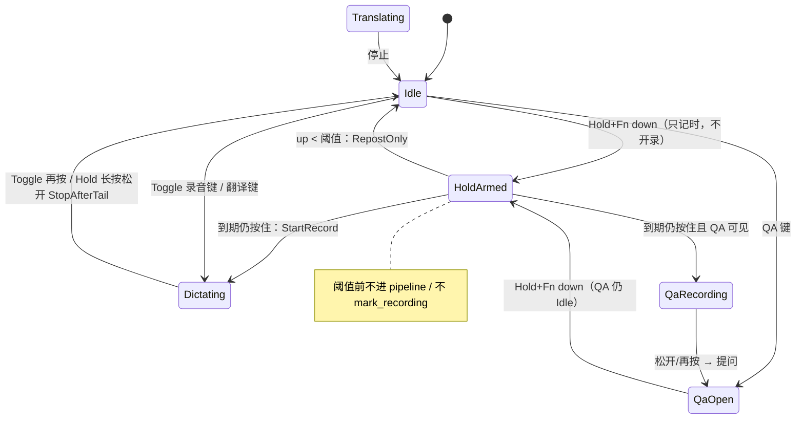
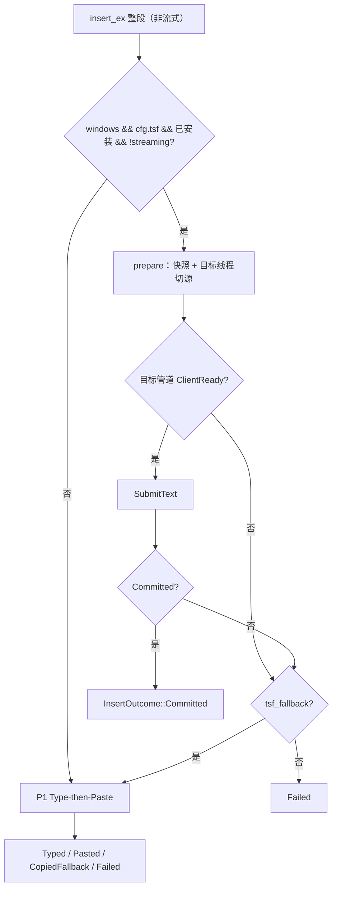
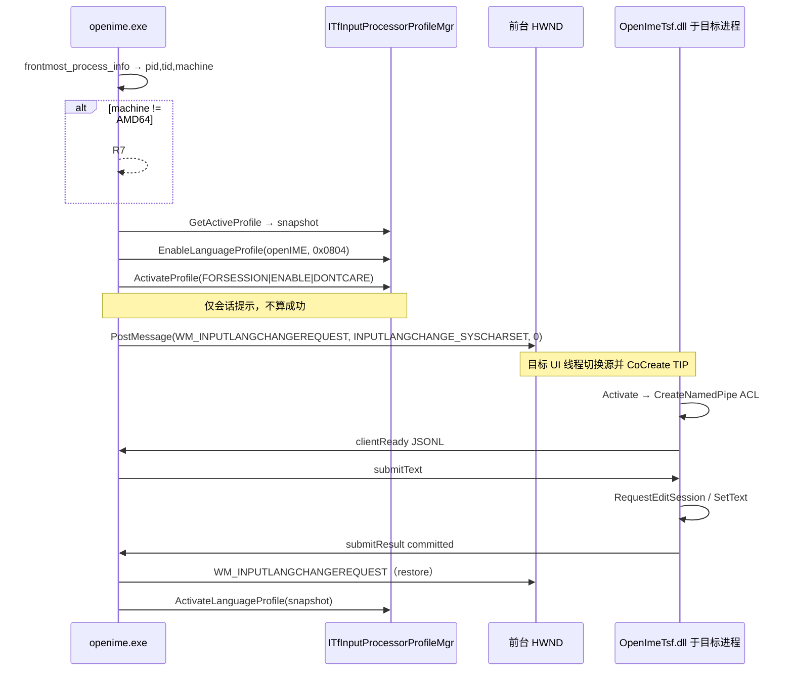
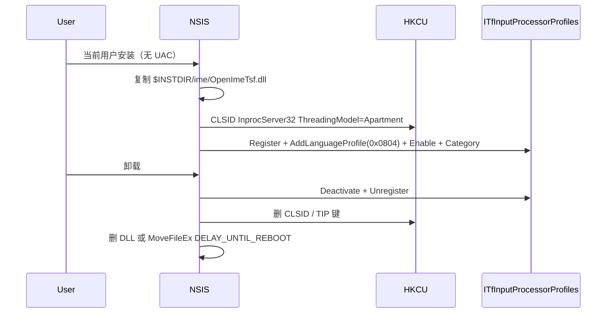
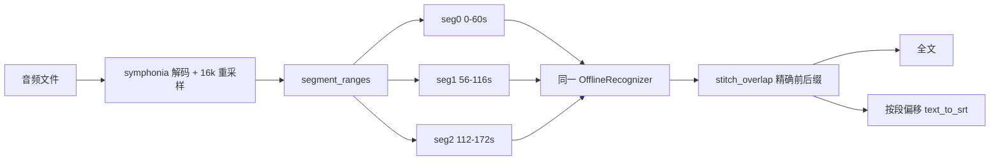
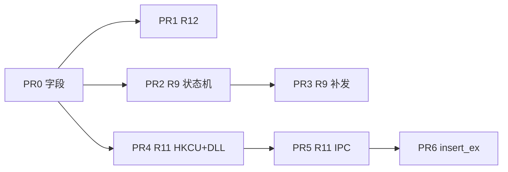

# ⚠️ 已归档：openIME P2 设计（ADR）

> **本文是 P2 需求的完整设计记录（ADR）。**
> - R9（短按补发）✅ 已实现
> - R12（长音频分段）✅ 已实现
> - R11（Windows TSF）**FFI 已落地**（见 [openIME-windows-porting-notes.md](./openIME-windows-porting-notes.md) §12），但 Win11 per-user TIP 受限需管理员注册 HKLM
> 当前实现状态与进度请以 [roadmap.md](./roadmap.md) 为准。本文保留作架构决策追溯。


| 字段 | 值 |
|---|---|
| 文档标题 | openIME P2 需求与技术一体方案 |
| 作者 | openIME 工程 |
| 日期 | 2026-08-13（修订 2026-08-14） |
| 状态 | Draft（评审修订） |
| 范围 | roadmap **R9 / R11 / R12**（当前 `docs/roadmap.md`） |
| 受众 | 将按本文实现的工程师（熟悉 `voice-core` + Tauri 薄壳 + P1 已落地架构） |
| 对齐 | [`docs/p1-design.md`](docs/p1-design.md) 已定：`SessionIntent`、插入四态、Type-then-Paste、热键中心、QA 窗。**P2 只增量，不推翻 P1。** |

---

## Overview

P1 已交付 SSRF 字面校验、翻译 / 前缀角色 / QA 浮窗、以及 Windows/macOS 共用的 Type-then-Paste 插入四态（`Typed` / `Pasted` / `CopiedFallback` / `Failed`）。P2 要一次设计清楚三件互相咬合、但工程量差一个数量级的事：

1. **R9 短按补发原按键**：在 **Fn + Hold** 下采用 **delay-start**——按下只记时，达到 `short_press_ms`（默认 300）仍按住才开录。提前松开**不进 pipeline**，只把 Fn/🌐 以 `flagsChanged` 补发给系统。macOS 换可拦截的 `CGEventTap`；自捕获以「补发后 50–80ms 忽略窗口」为主、user-data 为辅。
2. **R11 Windows TSF IME**：per-user（**HKCU**）注册 TIP DLL；激活必须打进**前台目标 UI 线程**（`WM_INPUTLANGCHANGEREQUEST` + 等目标管道 `ClientReady`）。`CommitText` 在目标进程内完成，失败回退 **P1 R7**。拆成「DLL+NSIS 注册」与「CommitText 通路」两阶段。
3. **R12 本地长音频分段 + 重叠**：文件转录（D3 ✅）今天把整段 16 kHz PCM 一次塞进**新的** `OfflineRecognizer`（**禁止**碰 `OFFLINE_RECOGNIZER_CACHE`）。按 60s 切、相邻 4s 重叠；全文用有界精确前后缀 stitch，SRT 用未 stitch 的段文本。不引入 CapsWriter `text_merger`。

三件事共享**一套** `AppConfig` 字段（分 PR 加 `#[serde(default)]`）、插入结果增加 `Committed`、以及 `abort ≠ stop` 安全网原语。实现顺序：**PR0 字段 → R12 ∥ R9 状态机 → R9 补发 → R11**。

---

## Background & Motivation

### 当前状态（与本文相关的事实）

| 能力 | 现状 | 关键代码 |
|---|---|---|
| Fn 监听 | ObjC `CGEventTap` **ListenOnly** + NSEvent global/local，只看 `keyCode==63` 的 `flagsChanged`；**不吞键** | [`fn_monitor.m`](src-tauri/src/platform/macos/fn_monitor.m) `cg_callback` / `handle_event`；[`fn_key.rs`](src-tauri/src/platform/macos/fn_key.rs) `openime_fn_edge` |
| Fn 边沿 | 按下：300ms 防抖后 `on_record_hotkey`；**松开无条件** 300ms 后 `request_stop()`（Toggle 也被当成 Hold） | [`lib.rs`](src-tauri/src/lib.rs) `on_fn_edge`（`STOP_GEN` / `LAST_TRIGGER_MS`） |
| Hold / Toggle | `HotkeyMode` 已有；**只有**「Hold 且已在录音时按下忽略」；松开停**没**按 mode 门控。P1：翻译 / QA **专用键**仅 Toggle | [`config.rs`](crates/voice-core/src/config.rs) `HotkeyMode`；[`lib.rs`](src-tauri/src/lib.rs) `on_translate_hotkey` / `on_qa_hotkey` |
| 录音停止 | `stop_flag` → 停采 → ASR finish → **插入并落库**。没有「中止且不上屏」 | [`state.rs`](src-tauri/src/state.rs) `request_stop`；[`pipeline.rs`](crates/voice-core/src/pipeline.rs) `record_and_collect`；[`commands.rs`](src-tauri/src/commands.rs) `toggle_recording` |
| 插入 | 四态 Type-then-Paste；`arboard` 只在薄壳；Windows `Ctrl+V` + exe basename 已按 P1 落地 | [`insert.rs`](crates/voice-core/src/insert.rs)；[`insert_fallback.rs`](src-tauri/src/insert_fallback.rs)；[`platform/windows/focus.rs`](src-tauri/src/platform/windows/focus.rs) |
| Windows IME | **无** TSF / C++ / COM；`install_fn_monitor` 空；bundle 只有 `nsis`，无 hook | [`platform/windows/fn_key.rs`](src-tauri/src/platform/windows/fn_key.rs)；[`tauri.conf.json`](src-tauri/tauri.conf.json) `bundle.targets` |
| 文件转录 | `decode_audio_file`（symphonia）→ 线性重采样 16 kHz → **整段** `transcribe_offline` → `text_to_srt` 按字数估时轴。Settings D3 卡只 `await transcribeFile`，无进度/取消 | [`transcribe.rs`](crates/voice-core/src/transcribe.rs) `transcribe_file_full`；[`commands.rs`](src-tauri/src/commands.rs) `transcribe_file`；[`Settings.tsx`](src/components/Settings.tsx) 文件转录卡片 |
| 离线听写 | `connect_offline_with_paths` 把整段样本一次 `accept_waveform`；**单槽** `OFFLINE_RECOGNIZER_CACHE` **仅**此路径使用 | [`sherpa.rs`](crates/voice-core/src/providers/sherpa.rs) `connect_offline_with_paths` / `get_cached_offline_recognizer` |
| 文件 vs 缓存 | `transcribe_file_full` 走 `build_offline_recognizer`，**新实例、不进缓存** | [`transcribe.rs`](crates/voice-core/src/transcribe.rs) `transcribe_file_full` |
| overlay 事件 | 只听 `recording://started\|partial\|processing\|polish-cancelled\|stopped\|error`，**无** `cancelled` | [`RecorderOverlay.tsx`](src/RecorderOverlay.tsx) |
| 保存热键 | `hotkeys_changed` 只比四根快捷键字符串，**不含** `hotkey_mode` | [`commands.rs`](src-tauri/src/commands.rs) `save_app_config` |
| `clear_stop` | 抢到 guard 且 `CpalAudioSource::new` **之后**才 `clear_stop()` | [`commands.rs`](src-tauri/src/commands.rs) `toggle_recording` |
| NSIS | `bundle.targets` = `app`+`nsis`；**无** `bundle.windows`；Tauri 2 NSIS **默认 `currentUser` / 无 UAC** | [`tauri.conf.json`](src-tauri/tauri.conf.json) |
| 本地模型 | 全部是 Offline 整段：SenseVoice / FireRed Large / FunASR-Nano；**无**流式 zipformer | [`asr_catalog.rs`](crates/voice-core/src/asr_catalog.rs) |
| 配置 | P1 字段已齐；`types.ts` / `Settings.test.tsx` `defaultConfig` 必须同步增量 | [`config.rs`](crates/voice-core/src/config.rs)；[`types.ts`](src/types.ts) |
| SQLite | `PRAGMA user_version = 4`（风格包前缀列）。P2 **不**加表 | [`store.rs`](crates/voice-core/src/store.rs) |
| CI | `voice-core` 三平台；`src-tauri` **仅 macOS** check；Release 打 dmg + NSIS | [`.github/workflows/ci.yml`](.github/workflows/ci.yml) / `release.yml` |
| P1 进度 | PR1–PR6 全部 ✅ | [roadmap.md](./roadmap.md) |

### 痛点

- **Fn 误触**：默认热键是 `Fn`，默认模式却是 Toggle。`on_fn_edge` 松开一律停，一次轻点 ≈ 开录 300ms 再停，产生空会话；同时 ListenOnly 不吞键，若系统「按下 🌐 键时」不是「不执行任何操作」，Globe 与录音抢同一边沿。用户指南只能要求关掉 🌐（[`user-guide.md`](docs/user-guide.md)、`settings.hotkey.fnWarning`）。
- **Windows 插入仍是模拟输入**：R7 解决了「enigo 失败就粘贴」，但中文 IME 组合态、UWP/安全桌面、远程桌面仍会吞键或抢组合。没有进程内 `CommitText`。
- **30 分钟会议录音**：`transcribe_offline` 一次 decode。SenseVoice / FireRed AED / FunASR-Nano 对超长波形会截断或 OOM；SRT 时间轴按整段字数比例估，段界附近的字直接消失。

### 竞品锚点（启发，**外仓不在工作区，不是对照过的源码拷贝**）

| 主题 | 启发（规范以本文为准） |
|---|---|
| 短按阈值 + 补发 | CapsWriter `event_handler.py::_handle_short_press`（`duration < threshold` → `task.cancel()` + `emulator.emulate_key`）；`emulator.py` 的 `_emulating_keys` 防自捕获；`ClientConfig.threshold = 0.3` |
| TSF 会话 | OpenLess `WindowsImeSessionController`：`prepare_session` 快照 → 激活自有 profile → IPC `SubmitText` → `restore_session`；失败 `should_fallback_after_ime_result`。管道名按目标 `pid-tid`；`CommitText` 发生在**目标进程内**的 TIP DLL |
| 文件分段 | CapsWriter `file_seg_duration=60` / `file_seg_overlap=4`。openIME **不**移植 `text_merger.py`（路线图 ⚪ 不做） |

---

## Goals & Non-Goals

### Goals

- Hold + 录音键为 `Fn` 时：短按不录音、不插字、不留有内容的历史；系统 🌐 原功能（切输入法等）经补发执行。
- 纠正 Fn 松开路径：`request_stop` **仅 Hold**。Toggle 的第二次**按下**才停（与设置文案一致）。
- Windows 安装器注册 TSF profile；听写 / 翻译 / QA「插入光标」在 TSF 可用时 `CommitText`；失败走 P1 R7，不丢字。
- 本地 sherpa 文件转录按 60s / 4s 重叠切片，30 分钟音频段间不丢字；SRT 按段时轴偏移；UI 有进度与取消。
- **一套** `AppConfig` 字段（全部 `#[serde(default)]`，由 PR0 一次加齐）；`types.ts` 与 `Settings.test.tsx` 的 `defaultConfig` 同步。

### Non-Goals

- **R8** 风格包分享 / 市场 / JSON 导入导出。
- **R10** 鼠标侧键 / 线控 MediaPlayPause。
- **请求期 DNS `lookup_host` + `classify_ip` 重绑定闭环**（P1 Alternative E 曾标「P2 residual」）。**当前 roadmap P2 无此编号需求**，本文不做；R3 仍维持「保存期字面 + 禁 redirect」。
- CapsWriter `text_merger.py` 模糊流式合并（路线图 ⚪）。R12 只用有界**精确**前后缀去重。
- 把分段重叠用于 **实时听写 / 超长按住录音**（`connect_offline_with_paths` 整段 decode 保持原样）。
- Linux fcitx5、macOS Input Method Kit、把 openIME 做成用户日常手打输入法。
- 翻译键 / QA 专用键短按补发；组合录音键（`Alt+Shift+D`）补发。
- 32-bit（WOW64）以及 **ARM64 原生** 目标进程 TSF（P2 只交 **x64** `OpenImeTsf.dll`；其它 machine 一律 R7）。
- WiX / MSI（当前 `bundle.targets` 只有 `app` + `nsis`）。
- 把 NSIS 改成 `perMachine` / 写 HKLM / 应用内 UAC `regsvr32`（采用 HKCU per-user TIP）。
- 在 `tauri dev` 未跑安装挂钩时假装 TSF 可用（未注册 → 100% R7）。
- Voice Agent、UDP、`.py` 角色热加载。
- 不要把 `AppConfig::default` 里过时的「Zipformer 流式」注释当现状（`local_asr_model` 才是真相）。

---

## Key Decisions

1. **短按补发只服务「录音键 == `Fn` 且 `hotkey_mode == Hold`」。**  
   Toggle 的主手势就是一次短触，若也走 300ms 误触，默认配置将永远无法开录。翻译键 / QA 键是 P1 Toggle-only 组合键，没有被偷走的系统功能，补发还会打到自己的 `on_hotkey`。组合录音键没有可靠 key-up。

2. **Fn 松开 `request_stop` 改为 Hold 专用。**  
   今天 Toggle+Fn 松开也会停，与「切换」文案相反。R9 与这条修正落在同一函数（`on_fn_edge`）。**发布说明必须写一条。**

3. **Hold+Fn 采用 delay-start，不是「按下立刻开录再 abort」。**  
   按下只 `ArmHoldTimer`；`short_press_ms` 到期仍按住才 `StartRecord`。提前松开 = `RepostOnly`，**不进** `on_record_hotkey` / QA `mark_recording`。timer 已 `StartRecord` 后的松开一律 `StopAfterTail`（识别+插入），**不** abort 刚过阈值的合法短句。  
   **`abort_flag` 仅防御**：`classify_fn_edge` / `on_fn_edge` **永不** `request_abort`。`toggle_recording` 保留**两处** `take_abort`（音频创建后、`record_and_collect` 返回后），供其它调用方或未来用。`request_stop` = 识别+插入；`request_abort` = 不上屏、不 QA 提问。

4. **松开分类看 `this_press_started_recording`。**  
   仅当**这一次** Fn down 在 `!already_recording` 时武装、并在阈值后真正 Start 过，松开才按「自己的」会话处理。翻译键 / UI / 已在录时的 Fn 短触 → `StopAfterTail`（停并插入），禁止 abort 别人的会话。

5. **Hold+Fn 的 tap 从 ListenOnly 改为 Default，长按吞 keyCode 63 的 flagsChanged；Toggle 不吞。**  
   吞键开关是**原子配置**（config 变更即 store），**不是**只在 `apply_hotkey` 写一次。`save_app_config` 把 `hotkey_mode`（及 `hotkey`）列入「需下发 tap 模式」路径。

6. **补发事件必须是一对 `kCGEventFlagsChanged`（keycode 63），两条都写 `kOpenimeRepostMagic`；禁止 `CGEventCreateKeyboardEvent` 的 keyDown/up 充当补发。**  
   自捕获**主**过滤器：`REPOST_IGNORE_MS`（50–80，默认 60）内忽略一切 keyCode 63 边沿。user-data 为辅。`g_reposting` 不得跨 runloop 当唯一保险。禁止在 tap 回调栈上 post 后假设同步可见：先写 ignore deadline 原子时间戳，再 `CFRunLoopPerformBlock` 到下一圈 post。NSEvent `handle_event` 用同一 ignore window。

7. **🌐 补发主路径是 HID `flagsChanged`；TIS 切输入源默认关（`fn_repost_tis_fallback=false`）。**

8. **`tsf_enabled` 组装规范：`windows && cfg.windows_tsf_enabled && 已安装 && !streaming`。**  
   `record_and_collect` 内流式 chunk **禁止** `Committed`。非流式成功集 = `Typed | Pasted | Committed`。失败且 `windows_tsf_fallback` → P1 R7。不把 TSF 做成第五种 `InsertStrategy`。

9. **`InsertOutcome` 增加 `Committed`。** HUD 与 Typed 一样静默成功。

10. **TSF 成功条件是目标进程管道 `ClientReady`，不是宿主 `GetActiveProfile`。**  
    激活路径写死：快照 → HKCU 已注册的 profile `Enable` → `ActivateProfile(FORSESSION|…)` 作会话提示 → 对前台 HWND `PostMessage(WM_INPUTLANGCHANGEREQUEST)` → 等 `OpenImeCommit-{pid}-{tid}` 的 `clientReady`（800ms）。语言 `0x0804`。只会话占用，用完 restore（幂等）。

11. **IME 安装范围 = per-user HKCU。不改 Tauri NSIS `installMode`（默认 `currentUser`，无 UAC）。禁止写「Tauri 默认 admin / HKLM」。**  
    DLL 只做 IPC + `ITfEditSession`；不做 `ITfKeyEventSink` 业务。管道 DACL = 当前用户 SID，拒绝 Everyone。宿主是 **client**（`CreateFile`），TIP 是 **server**（`CreateNamedPipe`）：宿主连上后 **`GetNamedPipeServerProcessId(client_handle) == 目标 pid`**，不符则断开 → R7。800ms 内 `WaitNamedPipe` + `CreateFile` 重试直到读到匹配 pid 的 `clientReady`。

12. **R12 只接 `transcribe_file_full`；禁止 `get_cached_offline_recognizer`。**  
    一次 `build_offline_recognizer`，顺序喂切片后 drop。实时 `connect_offline_with_paths` 一行不改。stitch：`k_min=2`，失败则拼接。SRT 用**未 stitch** 段文本。

13. **P2 不加 SQLite 迁移。** 一套字段由 **PR0** 一次加齐（`#[serde(default)]`），后续 PR 只读不改默认形状。

14. **GUID / 管道前缀 / CLSID 自有，禁止复用 OpenLess。** 见 R11 常量表。

15. **所有 `InsertOpts` 经 `InsertOpts::from_config(&cfg, frontmost, streaming)` 构造**（今日两处：`toggle_recording` 与 `qa::insert_last_answer`）。

---

## 统一架构

### Hold+Fn delay-start（abort 仅防御）



| 标志 | 谁置位 | 收尾 |
|---|---|---|
| `stop_flag` | Toggle 第二次按下；Hold 已开录后的松开（300ms 尾音）；UI 停 | 识别 + 按 intent 插入 / QA 提问 |
| `abort_flag` | **R9 主路径不置位。** 仅防御（其它命令/未来用） | 若被置位：**不**插入、**不** `ask_and_stream`；只 `delete_session(pipeline session_id)`；`qa::mark_recording(false)`；HUD processing「已取消」 |

`request_abort()` = `abort_flag=true` 且 `stop_flag=true`。R9 的 `classify_fn_edge` / `on_fn_edge` **不调用**它。  
`clear_stop` **同时清 abort**，因此必须在 CAS 成功后、**任何 await / `CpalAudioSource::new` 之前**调用一次；之后禁止再 `clear_stop` 直到本轮结束。

`take_abort()` **仅两处**（防御，delay-start 主路径走不到）：

1. 音频创建之后、`record_and_collect` 之前  
2. `record_and_collect` 返回后、**先于** streaming persist / QA `begin_streaming` / `insert_finals_with_polish`

abort 时：`qa::mark_recording(false)`；`delete_session(&r.session_id)` 仅 pipeline 会话，**禁止**碰 QA 面板 `history_session_id`；release guard；`recording://processing` = 「已取消」；Rust 400ms 后 `hide_overlay_only`。**不发** `recording://stopped`，**不发** 新事件 `recording://cancelled`。

### 插入优先级（P1 四态 + P2 `Committed`）



流式 C1：`InsertOpts::from_config(..., streaming=true)` 强制 `tsf_enabled=false`；chunk 成功集只有 `Typed | Pasted`。

### 配置模型（一套字段，分 PR 加 `#[serde(default)]`）

全部 `#[serde(default)]`，旧 JSON 可反序列化。字段所有权见 PR Plan。

```rust
// —— R9 ——
pub short_press_ms: u32,                 // 默认 300；范围 100..=800
pub fn_repost_enabled: bool,             // 默认 true；仅 Hold+Fn 读取
pub fn_repost_tis_fallback: bool,        // 默认 false

// —— R11（非 Windows 读了也忽略）——
pub windows_tsf_enabled: bool,           // 默认 true
pub windows_tsf_fallback: bool,          // 默认 true

// —— R12 ——
pub file_seg_duration_secs: u32,         // 默认 60；范围 10..=180
pub file_seg_overlap_secs: u32,          // 默认 4；须 < duration 且 >= 1
```

`save_app_config` 追加：

- `short_press_ms ∈ [100, 800]`
- `file_seg_overlap_secs < file_seg_duration_secs`
- `file_seg_duration_secs ∈ [10, 180]`，`file_seg_overlap_secs ∈ [1, 30]`
- 失败整单不落盘（与 P1 URL / 热键冲突同一策略）

前端：`src/types.ts`、`Settings.test.tsx` 的 `defaultConfig`、i18n zh/en。设置页：

- 快捷键卡：短按阈值（全平台可留，给将来非 Fn 短按）；**「Hold 下短按 Fn 补发 🌐」仅 `cfg(macos)` 渲染，非 macOS 隐藏**（不要灰字占位）。
- 插入卡：Windows「优先 TSF 上屏 / 失败回退粘贴」+ IME 安装状态只读 +「恢复系统输入法」按钮（FR-11.13）。
- 文件转录卡：分段时长 / 重叠 + `transcribe://progress` 进度 + 取消（`cancel_transcribe`）；转录中 disable 选择按钮。

### 与 P1 热键互斥表的增量

P1 表不变。R9 只改 **Fn 边沿** 在「录音键」列里的语义：

| 当前状态 | Hold+Fn down | Hold+Fn up < 阈值 | Hold+Fn 已开录后松开 | Toggle+Fn 按下 | 翻译键 |
|---|---|---|---|---|---|
| Idle | **ArmHoldTimer**（不开录、无 HUD） | **RepostOnly** | — | 开始听写 | 翻译 |
| 听写中（本次 Fn 开的） | IgnorePress | — | StopAfterTail | 停止+识别 | toast |
| 翻译/UI 开的录音中 | IgnorePress（`this_press_started_recording=false`） | **StopAfterTail**（插入译文，**不** abort、不补发） | StopAfterTail | 停止+识别 | toast |
| QA 可见未录 | ArmHoldTimer（QA 仍 Idle） | RepostOnly（**不进** `QaRecording`） | — | 开始 QA 录音 | 忽略 |
| QA 录音中（本次 Fn 开的） | IgnorePress | — | 停 QA → 提问 | 停 QA → 提问 | 忽略 |

delay-start 下「短按」= 阈值前松开，**从未** `StartRecord`。已过阈值后的松开一律停止+识别。

---

## R9. 短按补发原按键（Fn 误触恢复）

### 用户故事

作为用 **按住 Fn 说话** 的用户，我不小心轻点了一下 🌐：录音 HUD **根本不出现**，光标处不插字，系统该切输入法切输入法。我按住超过约 0.3s 再松手，行为与今天 Hold 一致（尾音 300ms 后识别上屏）。

### 场景

| # | 场景 | 期望 |
|---|---|---|
| S9.1 | Hold + Fn，按下 120ms 松开 | **不**调用 `toggle_recording`；无 HUD；🌐 执行一次 |
| S9.2 | Hold + Fn，按下 800ms 说话后松开 | 录音 + 300ms 尾音 + 上屏；输入法不被这次松开再切一次 |
| S9.3 | Toggle + Fn，轻点 | **开始**听写（不补发）；再点停止 |
| S9.4 | QA 窗可见 + Hold + Fn 短按 | **不进** `QaRecording`、不 `mark_recording(true)`；补发 🌐 |
| S9.5 | 录音键改为 `Alt+Shift+D` | 无补发、无 delay-start |
| S9.6 | 翻译键 / QA 键轻点 | 与 P1 相同 Toggle，不补发 |
| S9.7 | 翻译进行中短按 Fn（Hold） | **停止翻译并插入**，不 abort、不补发 |
| S9.8 | QA Streaming 中短按 Fn | 不 `cancel_stream`；classify = 已不在录音 → RepostOnly 或 Ignore（流式取消仍是录音键 Toggle / ESC） |
| S9.9 | UI「开始录音」后短按 Fn | StopAfterTail（插入），不 abort |

### 功能需求

| ID | 需求 |
|---|---|
| FR-9.1 | 可配置 `short_press_ms`（默认 300）。计时从 **Fn down** 到 **Fn up**（`fn_down` 边沿，不是 debounce 时钟）。 |
| FR-9.2 | 仅当 `hotkey == "Fn"`（忽略大小写）且 `hotkey_mode == Hold` 时启用 delay-start + 短按补发（补发另受 `fn_repost_enabled`）。 |
| FR-9.3 | **delay-start**：阈值前**不得** `on_record_hotkey` / `mark_recording` / 显示 overlay。提前松开只 `RepostOnly`。 |
| FR-9.4 | 阈值到期仍按住：`StartRecord`，置 `this_press_started_recording=true`。此后松开走 `STOP_GEN` + 300ms 尾音 `request_stop()`。 |
| FR-9.5 | Toggle + Fn：按下走 `on_record_hotkey`；**松开不** `request_stop`。 |
| FR-9.6 | Hold + 已在录音时再按下：忽略（已有）。松开：若 `this_press_started_recording==false` → `StopAfterTail`（结束别人开的会话并插入）。 |
| FR-9.7 | 补发是一对 **`kCGEventFlagsChanged`**（keycode 63）：down 带 `kCGEventFlagMaskSecondaryFn`，up 清该 flag。**禁止** keyDown/keyUp 充当补发。 |
| FR-9.8 | **两条**补发事件都写 `kCGEventSourceUserData = 0x4F494D45`。自捕获**主**过滤：`REPOST_IGNORE_MS=60` 内忽略 keyCode 63 边沿（CGEventTap **与** NSEvent `handle_event`）。 |
| FR-9.9 | Hold+Fn：CGEventTap `kCGEventTapOptionDefault`；仅 `keycode==63` 的 flagsChanged 返回 `NULL`。Tap mask **只有** `flagsChanged`，F1–F12 的 keyDown **不在 mask**，不会被吞。 |
| FR-9.10 | Tap 创建失败：ListenOnly + NSEvent，**关闭补发与吞键**。toast 区分 Accessibility vs Input Monitoring（若能从 API/日志分辨；否则一条文案同时点名两项）。 |
| FR-9.11 | `fn_repost_tis_fallback=true` 且 HID 补发后 50ms 前台输入源未变：TIS 下一个输入源。默认 false。 |
| FR-9.12 | `fn://edge`：真实边沿仍推；补发边沿 / ignore window 内不推。 |
| FR-9.13 | 若 `take_abort` 为真（非 R9 主路径）：只发 `recording://processing` = i18n `overlay.cancelled`；Rust 400ms 后 `hide_overlay_only`。**不**发 `recording://cancelled`，**不**发带文本的 `recording://stopped`。overlay **不必**加新监听。 |
| FR-9.14 | `this_press_started_recording`：Fn down 且当时 `!already_recording` 时武装；`StartRecord` 成功调用后置 true；stop/abort/RepostOnly 清 false。 |
| FR-9.15 | 吞键原子：`FN_TAP_CONSUME: AtomicBool`，在 `save_app_config` 写入 config 后按 `hotkey==Fn && Hold` store；`apply_hotkey` 同样 store。回调每次 load，不缓存「启动时的 mode」。 |

### 非功能

| ID | 需求 |
|---|---|
| NFR-9.1 | `classify_fn_edge` 纯函数，`cargo test -p openime` ≥ 14 case，不碰 AppKit。 |
| NFR-9.2 | 补发不得在 tap 回调栈上同步 `CGEventPost` 后假设可见；先写 ignore deadline，再 `CFRunLoopPerformBlock`。不得 `dispatch_sync` 到主线程。 |
| NFR-9.3 | 短按：松开后无 HUD（从未 show）。防御 abort：processing「已取消」后 400ms hide。不上屏。 |
| NFR-9.4 | `FN_PRESS_DEBOUNCE_MS=300` 与 `cfg.short_press_ms` 分开命名。`REPOST_IGNORE_MS=60`。**按下必须先 debounce 再 `HOLD_GEN += 1`**，重复 down 不得取消已武装的 delay-start。 |
| NFR-9.5 | Tap 失败 toast 点名「辅助功能」与「输入监控」。 |
| NFR-9.6 | 只处理 keycode 63 的 flagsChanged；功能键 keyDown 不在 tap mask，不会被本回调吞掉。 |

### 验收（可复现）

| # | 类型 | 操作 | 期望 |
|---|---|---|---|
| A9.1 | **手工** | 系统 🌐=「切换输入法」，Hold+Fn，短按 | 输入法切换；无 HUD；`toggle_recording` 未调用 |
| A9.2 | **手工** | 同上，按住 >0.5s 说「你好」松开 | 光标「你好」；输入法**不**因这次松开再切一次 |
| A9.3 | 自动 | `classify_fn_edge` 表 | 见下方 |
| A9.4 | 自动 | 人为置 `abort_flag` 后收尾（防御 API，R9 主路径不置） | `insert_ex`=0；`delete_session(pipeline id)`；不删 QA history |
| A9.4b | 自动 | Hold+Fn+百炼 `streaming_insert`：delay-start 后未松 | 流式 chunk 的 `InsertOpts.tsf_enabled==false`；短按路径根本不进 streaming |
| A9.5 | **手工** | Toggle+Fn 点一下 | 进入聆听；再点停止 |
| A9.6 | **手工** | QA 打开 + Hold+Fn 短按 | QA **始终** Idle（无 Recording 闪烁）；🌐 切换 |
| A9.7 | 自动 | `should_ignore_fn_edge(now, deadline, user_data)` | ignore window 内 true；窗口外且无 magic false |
| A9.8 | **手工** | 关 `fn_repost_enabled`，Hold 短按 | 仍不开录；**不**补发 |
| A9.9 | 自动 | `this_press_started_recording=false` + already_recording + 短松开 | `StopAfterTail`（翻译/UI） |
| A9.10 | 自动 | 只改 `hotkey_mode` Toggle→Hold 保存 | `FN_TAP_CONSUME` 变为 true（不依赖 `apply_hotkey` 因热键字符串变化才跑） |

### 接入点

| 位置 | 改动 |
|---|---|
| **新** [`src-tauri/src/fn_policy.rs`](src-tauri/src/fn_policy.rs) | `classify_fn_edge` / `FnEdgeAction` / `should_ignore_fn_edge` / 阈值校验 |
| [`lib.rs`](src-tauri/src/lib.rs) `on_fn_edge` | delay-start 定时器；Hold 松开才尾音停；`RepostOnly` 调 `schedule_repost_fn` |
| [`state.rs`](src-tauri/src/state.rs) | `abort_flag`；`request_abort` / `take_abort`；`clear_stop` 在 CAS 后立刻调用 |
| [`commands.rs`](src-tauri/src/commands.rs) `toggle_recording` | CAS 后立刻 `clear_stop`；**两处** `take_abort`（防御）；若 abort：processing「已取消」+ 400ms hide |
| [`commands.rs`](src-tauri/src/commands.rs) `save_app_config` | `hotkeys_changed` **或** `hotkey_mode` 变化 → `store_fn_tap_consume` |
| [`fn_monitor.m`](src-tauri/src/platform/macos/fn_monitor.m) | Default tap；flagsChanged 补发；ignore deadline；`handle_event` 同步过滤 |
| [`fn_key.rs`](src-tauri/src/platform/macos/fn_key.rs) | `schedule_repost_fn`；`set_fn_tap_consume`；`fn_tap_can_consume` |
| PR0 字段 + Settings | 三个 R9 字段；**非 macOS 隐藏补发开关**；`fnWarning`：Toggle 仍建议 🌐=不执行 |
| [`qa.rs`](src-tauri/src/qa.rs) | 阈值前不 `mark_recording`；若防御 abort：`mark_recording(false)` + phase Idle |
| [`RecorderOverlay.tsx`](src/RecorderOverlay.tsx) | **不改事件集**；复用 `recording://processing` |

Windows：`install_fn_monitor` 仍为空。补发开关隐藏。阈值输入框可留。

### 关键算法 / 状态机

```rust
// src-tauri/src/fn_policy.rs
#[derive(Debug, Clone, Copy, PartialEq, Eq)]
pub enum FnEdgeAction {
    ArmHoldTimer,     // Hold+Fn down && !recording：只记时
    StartRecord,      // 定时器到期仍按住；或 Toggle 且 !recording
    IgnorePress,      // Hold + 已在录音
    ToggleStop,       // Toggle + 已在录音 + 按下
    StopAfterTail,    // Hold 松开且（this_press_started || already_recording）
    RepostOnly,       // Hold+Fn 松开且从未 Start；fn_repost_enabled
    IgnoreRelease,    // Toggle 松开；非 Fn；或短按但关补发
    // 无 AbortAndRepost：R9 主路径不 abort。timer 已 Start 后松开 = StopAfterTail。
}

pub struct FnEdgeCtx {
    pub pressed: bool,
    pub hold: bool,
    pub already_recording: bool,
    pub this_press_started_recording: bool,
    pub press_duration_ms: Option<u64>,
    pub threshold_ms: u64,
    pub is_fn_hotkey: bool,
    pub fn_repost_enabled: bool,
}

pub fn classify_fn_edge(c: FnEdgeCtx) -> FnEdgeAction {
    if c.pressed {
        if c.hold && c.already_recording { return FnEdgeAction::IgnorePress; }
        if !c.hold && c.already_recording { return FnEdgeAction::ToggleStop; }
        if c.hold && c.is_fn_hotkey { return FnEdgeAction::ArmHoldTimer; }
        return FnEdgeAction::StartRecord;
    }
    if !c.hold { return FnEdgeAction::IgnoreRelease; }
    if !c.is_fn_hotkey { return FnEdgeAction::IgnoreRelease; }
    if c.this_press_started_recording || c.already_recording {
        return FnEdgeAction::StopAfterTail;
    }
    if c.fn_repost_enabled { FnEdgeAction::RepostOnly } else { FnEdgeAction::IgnoreRelease }
}

/// 主自捕获过滤器。deadline = post 前写入的 now+REPOST_IGNORE_MS。
pub fn should_ignore_fn_edge(now_ms: u64, ignore_until_ms: u64, is_magic_userdata: bool) -> bool {
    is_magic_userdata || now_ms < ignore_until_ms
}
```

表驱动最少用例（`own` = `this_press_started_recording`）：

| pressed | hold | rec | own | dur | is_fn | repost | action |
|---|---|---|---|---|---|---|---|
| 1 | 1 | 0 | 0 | — | 1 | 1 | ArmHoldTimer |
| 1 | 1 | 1 | 0 | — | 1 | 1 | IgnorePress |
| 1 | 0 | 0 | 0 | — | 1 | 1 | StartRecord |
| 1 | 0 | 1 | 0 | — | 1 | 1 | ToggleStop |
| 0 | 1 | 0 | 0 | 120 | 1 | 1 | RepostOnly |
| 0 | 1 | 0 | 0 | 120 | 1 | 0 | IgnoreRelease |
| 0 | 1 | 1 | 1 | 800 | 1 | 1 | StopAfterTail |
| 0 | 1 | 1 | 0 | 80 | 1 | 1 | StopAfterTail（翻译/UI） |
| 0 | 0 | 1 | 0 | 120 | 1 | 1 | IgnoreRelease |
| 0 | 1 | 1 | 0 | 120 | 0 | 1 | IgnoreRelease |
| 1 | 1 | 0 | 0 | — | 0 | 1 | StartRecord（组合键无 delay） |

`on_fn_edge` 伪代码：

```text
static FN_DOWN_MS, HOLD_GEN, THIS_PRESS_STARTED
static STOP_GEN, LAST_TRIGGER_MS, IGNORE_UNTIL_MS

if should_ignore_fn_edge(now, IGNORE_UNTIL_MS, false): return  // ObjC 已滤 magic

if pressed:
    // 先 debounce：重复 down（双监听漏网 / 测试注入）不得 HOLD_GEN+=1，以免取消已武装的 timer。
    if debounce: return
    FN_DOWN_MS = now
    THIS_PRESS_STARTED = false
    STOP_GEN += 1
    HOLD_GEN += 1
    match classify(...):
        IgnorePress => return
        ArmHoldTimer =>
            gen = HOLD_GEN
            spawn sleep(short_press_ms)
            if HOLD_GEN==gen && fn still logically down:
                THIS_PRESS_STARTED = true
                on_record_hotkey(app)
        StartRecord | ToggleStop => on_record_hotkey(app)
else:
    HOLD_GEN += 1   // 取消未到期的 delay-start
    dur = now - FN_DOWN_MS
    match classify(..., Some(dur), THIS_PRESS_STARTED):
        IgnoreRelease => return
        RepostOnly =>
            schedule_repost_fn()   // 先写 IGNORE_UNTIL，下一圈 runloop 再 post
            THIS_PRESS_STARTED = false
        StopAfterTail =>
            300ms STOP_GEN 尾音 → request_stop()
            THIS_PRESS_STARTED = false
    // 无 AbortAndRepost 分支：不 request_abort
```

`toggle_recording` 时序（**两处**防御 `take_abort`；R9 主路径不置 abort）：

```text
CAS recording_guard
clear_stop()                    // 立刻，任何 await 之前
... validate / pipeline() / CpalAudioSource::new ...
if take_abort(): cleanup; return
record_and_collect(...)
if take_abort():
    delete_session(pipeline_session_id)  // 非 QA history_session_id
    qa::mark_recording(false)
    emit processing「已取消」
    spawn 400ms hide_overlay_only
    release guard; return
// 正常 streaming persist / QA ask / insert_finals
```

ObjC 补发（**flagsChanged**，不是 keyDown）：

```objc
static const int64_t kOpenimeRepostMagic = 0x4F494D45; // 'OIME'
static const uint64_t kRepostIgnoreMs = 60;
static _Atomic uint64_t g_ignore_until_ms = 0;

static uint64_t monotonic_ms(void); // mach_absolute_time 或 gettimeofday

static bool is_repost(CGEventRef e) {
    return CGEventGetIntegerValueField(e, kCGEventSourceUserData) == kOpenimeRepostMagic;
}

static bool in_ignore_window(void) {
    return monotonic_ms() < atomic_load(&g_ignore_until_ms);
}

// Rust 先调这个再请 runloop block post。
void openime_arm_repost_ignore(void) {
    atomic_store(&g_ignore_until_ms, monotonic_ms() + kRepostIgnoreMs);
}

int openime_repost_fn(void) {
    openime_arm_repost_ignore();
    CGEventSourceRef src = CGEventSourceCreate(kCGEventSourceStateHIDSystemState);
    CGEventRef down = CGEventCreate(src);
    CGEventRef up   = CGEventCreate(src);
    CGEventSetType(down, kCGEventFlagsChanged);
    CGEventSetType(up,   kCGEventFlagsChanged);
    CGEventSetIntegerValueField(down, kCGKeyboardEventKeycode, 63);
    CGEventSetIntegerValueField(up,   kCGKeyboardEventKeycode, 63);
    CGEventSetFlags(down, kCGEventFlagMaskSecondaryFn);
    CGEventSetFlags(up, 0);
    CGEventSetIntegerValueField(down, kCGEventSourceUserData, kOpenimeRepostMagic);
    CGEventSetIntegerValueField(up,   kCGEventSourceUserData, kOpenimeRepostMagic);
    CGEventPost(kCGHIDEventTap, down);
    CGEventPost(kCGHIDEventTap, up);
    CFRelease(down); CFRelease(up); CFRelease(src);
    return 1;
}

static CGEventRef cg_callback(...) {
    if (type == tap disabled) { CGEventTapEnable(tap, true); return event; }
    if (type != kCGEventFlagsChanged) return event;
    if (keycode != 63) return event;
    if (is_repost(event) || in_ignore_window()) return event; // 放行补发，不回调 Rust
    // 边沿 → openime_fn_edge
    if (atomic_load(&g_fn_tap_consume)) return NULL;
    return event;
}

// NSEvent handle_event：同样 if (in_ignore_window()) return;
```

Rust 侧 `schedule_repost_fn`：

```text
openime_arm_repost_ignore()
CFRunLoopPerformBlock(main, common, ^{ openime_repost_fn(); })
```

`g_fn_tap_consume` 由 `set_fn_tap_consume(hotkey==Fn && Hold)` 在 **每次** `save_app_config` 写完 config 后以及 `apply_hotkey` 里 store。Toggle 不吞 🌐（与今天、user-guide 一致）。

### 错误与边界

| 边界 | 行为 |
|---|---|
| 按下防抖 vs 短按阈值 | `FN_PRESS_DEBOUNCE_MS` 滤双监听二次 down；`short_press_ms` 量按住时长 |
| 尾音 300ms | 仅 `StopAfterTail`；`RepostOnly` 立刻补发、无 HUD |
| delay-start 与 `clear_stop` | 短按不进 `toggle_recording`。CAS 后立刻 `clear_stop`；**两处**防御 `take_abort` |
| QA Streaming 短按 Fn | 不在录音 → RepostOnly；不 `cancel_stream` |
| 翻译中短按 Fn | `own=false` + rec=true → StopAfterTail |
| Secure Input / tap 失败 | 不补发；toast 辅助功能+输入监控 |
| HID 切不了输入法 | TIS 开关；表情面板无法合成 |
| `short_press_ms=800` | 用户须按住 800ms 才开录 |

### 风险（R9）

| 风险 | 严重度 | 缓解 |
|---|---|---|
| HID flagsChanged 补发不触发 🌐 | 高 | A9.1 真机；TIS 开关 |
| 误吞功能键 | 低 | mask 仅 flagsChanged；只吞 keycode 63 |
| 自捕获死循环 | 高 | ignore window **主**过滤 + 双事件 magic |
| Toggle 松开不再停 | 中 | Release note |
| 阈值边界竞态已 Start | 低 | 松开走 `StopAfterTail`（插入短句）；不 abort |

---

## R11. Windows IME TSF 集成

### 用户故事

作为 Windows 用户，我在 Word / 浏览器 / 微信里听写时，文字应直接进入当前文档的插入点，即使该处正在用微软拼音组合态，也不应把按键打进组合窗口或抢焦点。若 IME 未安装或目标是 32 位进程，应自动退回 P1 的 Ctrl+V 粘贴兜底。

### 场景

| # | 场景 | 期望 |
|---|---|---|
| S11.1 | 已用 NSIS 安装，前台 notepad.exe 64-bit | 听写结果 `Committed`，剪贴板不动 |
| S11.2 | `tauri dev` 未注册 TIP | 静默 R7 |
| S11.3 | TSF 提交失败（超时 / Rejected） | `windows_tsf_fallback=true` → R7 |
| S11.4 | 用户正在用微软拼音打字，开着候选窗 | 会话激活 openIME profile → CommitText → **恢复**微软拼音 |
| S11.5 | QA「插入光标」 | 同一 `insert_ex`，用开窗时 frontmost |
| S11.6 | 百炼流式逐字 | **不**走 TSF |
| S11.7 | 卸载 NSIS | HKCU profile / COM 项删除，语言栏无残留 |
| S11.8 | 前台为 ARM64 或 WOW64 进程 | 不 activate，R7 |

### 功能需求

| ID | 需求 |
|---|---|
| FR-11.1 | 交付 **x64** `OpenImeTsf.dll`：`ITfTextInputProcessorEx` + `ITfThreadMgrEventSink` + `ITfEditSession`。CRT：`/MT`（静态 CRT，避免目标进程缺 VC 运行库）。C++17。 |
| FR-11.2 | NSIS hook（**per-user，HKCU**）：复制 DLL 到 `$INSTDIR\ime\OpenImeTsf.dll`；写 `HKCU\Software\Classes\CLSID\{CLSID}\InprocServer32` + `ITfInputProcessorProfiles::Register`（当前用户）+ 语言 0x0804 + Keyboard / Immersive / Systray Category。**不写 HKLM。不改 `installMode`。** 卸载对称删除；DLL 被锁则 `MoveFileEx(..., DELAY_UNTIL_REBOOT)`。 |
| FR-11.3 | 运行时 **不**弹 UAC。设置页只读 `windows_ime_status`（探测 **HKCU** CLSID + 文件存在 + TIP 键）。 |
| FR-11.4 | `WindowsImeSessionController`：`prepare_session` → `submit` → `restore_session`。`Prepared` 含 `restored: bool`；restore / Drop **幂等**（第二次 no-op）。 |
| FR-11.5 | 激活 flags：`TF_IPPMF_FORSESSION \| DONTCARECURRENTINPUTLANGUAGE \| ENABLEPROFILE` 仅作**会话提示**。真正成功 = **目标** `clientReady`。Restore：对目标 HWND 再 `WM_INPUTLANGCHANGEREQUEST` + legacy `ChangeCurrentLanguage` + `ActivateLanguageProfile`，再尽力现代 `ActivateProfile`（失败只 warn）。 |
| FR-11.6 | IPC：IME 在**目标进程** `Activate` 时 `CreateNamedPipe`（**server**）。宿主 `WaitNamedPipe` + `CreateFile`（**client**），在 800ms 内重试直到连上。连上后 **`GetNamedPipeServerProcessId(host_handle) == frontmost_process_info.pid`**，不符则断开 → `Failed`/`timeout` → R7。TIP 侧可用 `GetNamedPipeClientProcessId` 记日志，**不必**等于目标 pid。DACL：owner=当前用户 SID，拒绝 Everyone。JSONL（每条 `\n` 结尾，无 BOM）。 |
| FR-11.7 | `CommitText`：管道消息投递到 TIP 线程后 `RequestEditSession(TF_ES_SYNC \| TF_ES_READWRITE)` → `SetText`。 |
| FR-11.8 | 结果：`Committed` / `Rejected` / `Failed`。`error_code`：`timeout` / `no_document` / `rejected` / `too_large` / `protocol`。后两者+Failed 在 fallback 时进 R7。 |
| FR-11.9 | `InsertOutcome::Committed`；HUD 与 Typed 相同。 |
| FR-11.10 | `frontmost_process_info() -> {pid, tid, machine}`。`GetWindowThreadProcessId` 的**返回值是 tid**，pid 走出参。`IsWow64Process2`（或 `GetProcessInformation`）读 machine。`machine != AMD64`（含 I386 / ARM64 / 未知）→ 不 activate，debug log，R7。 |
| FR-11.11 | 设置：Installed / NotInstalled / RegistrationBroken / NotWindows；DLL 路径；`using_tsf`。探测读 **HKCU**。 |
| FR-11.12 | 流式 C1：`from_config(..., streaming=true)` 令 `tsf_enabled=false`；`record_and_collect` 内若见到 `tsf_enabled && streaming` 则忽略 TSF。 |
| FR-11.13 | 设置页「恢复系统输入法」：restore 最近快照；无快照则尝试激活用户语言下非 openIME 的 profile（常见 0x0804 微软拼音）。写入 PR6。 |
| FR-11.14 | `InsertOpts::from_config` 为**唯一**业务构造器；`toggle_recording` 与 `qa::insert_last_answer` 都必须走它。 |

### 非功能

| ID | 需求 |
|---|---|
| NFR-11.1 | DLL 零网络、零文件写入（除调试 OutputDebugString）；崩溃不得拖死宿主——`DllMain` 只做禁用 thread notify + 标记。 |
| NFR-11.2 | 协议编解码、`restore_decision`、`should_fallback_after_ime`、管道名纯函数单测（macOS 也能跑）。PR5 与 C++ 共用 `src-tauri/windows-ime/fixtures/*.json`（Rust `include_str!`）。 |
| NFR-11.7 | C++ JSON：**手写最小 parser**（只认本协议 4 种 type），无 nlohmann/rapidjson，无 C++ 异常越过 COM 边界。 |
| NFR-11.3 | 单次提交超时 800ms；prepare+submit+restore 目标 p95 ≤ 100ms（本机空闲 notepad）。 |
| NFR-11.4 | 文本上限 64 KiB UTF-8；超过走 R7（不截断静默）。 |
| NFR-11.5 | Windows CI：编译 DLL + `cargo test -p openime`（cfg windows 模块）。macOS CI 不编 C++。 |
| NFR-11.6 | rustc **1.75** 兼容（与 P1 相同，不用 1.84 IP 辅助）。 |

### 验收

| # | 类型 | 期望 |
|---|---|---|
| A11.1 | **手工** Win64 + 已安装 | 记事本 `Committed`；语言栏在插入后回到原 IME |
| A11.2 | **手工** 未安装 | 与 P1 A7.1 相同 Typed/Pasted |
| A11.3 | 自动 | `restore_decision`：有快照且仍停在 openIME → Restore；用户已手切走 → Keep |
| A11.4 | 自动 | `should_fallback_after_ime(Rejected/Failed)==true`，`Committed==false` |
| A11.5 | 自动 | 协议 JSON 驼峰 roundtrip；管道名含 pid-tid |
| A11.6 | **手工** 微软拼音候选开着时插入 | 文本进文档，候选解散或恢复后仍可用拼音 |
| A11.7 | **手工** 卸载后语言栏无「openIME」 | HKCU TIP / CLSID 键不存在 |
| A11.8 | 自动 | 非流式 `insert_ex` mock TSF Committed → 不碰 `remember_pending` |
| A11.8b | 自动 | `from_config(..., streaming=true).tsf_enabled == false`；流式成功集不含 Committed |
| A11.9 | 自动 | 黄金 fixture 4 条 roundtrip（见下） |
| A11.10 | 自动 | `frontmost_process_info` 对 HWND(0) → None；假 machine 走 R7 分支 |

### 接入点

| 位置 | 改动 |
|---|---|
| **新** `src-tauri/windows-ime/` | C++：`dllmain.cpp` `class_factory.cpp` `text_service.cpp` `edit_session.cpp` `ipc_server.cpp` `registry.cpp` `guids.h` `OpenImeTsf.def` `CMakeLists.txt` |
| **新** `src-tauri/src/windows_ime/{mod,protocol,profile,session,ipc}.rs` | 纯协议 + `#[cfg(windows)]` 实现；非 Windows stub 返回 `NotWindows` |
| **新** `src-tauri/windows/hooks.nsh` | `NSIS_HOOK_POSTINSTALL` / `PREUNINSTALL`（HKCU） |
| [`tauri.conf.json`](src-tauri/tauri.conf.json) | `bundle.windows.nsis.installerHooks`；resources 打进 `ime/OpenImeTsf.dll` |
| [`insert_fallback.rs`](src-tauri/src/insert_fallback.rs) | `insert_ex` 最前尝试 TSF |
| [`insert.rs`](crates/voice-core/src/insert.rs) | `InsertOutcome::Committed` |
| [`traits.rs`](crates/voice-core/src/traits.rs) | 注释：五态 |
| [`config.rs`](crates/voice-core/src/config.rs) / types / Settings | `windows_tsf_*` |
| [`commands.rs`](src-tauri/src/commands.rs) | `windows_ime_status` / `windows_ime_restore_profile`；`InsertOpts::from_config` |
| [`qa.rs`](src-tauri/src/qa.rs) | `insert_last_answer` 必须 `from_config(..., streaming=false)` |
| [`platform/windows/focus.rs`](src-tauri/src/platform/windows/focus.rs) | `frontmost_process_info`：tid=API 返回值，pid=出参，`IsWow64Process2` → machine |
| [`Cargo.toml`](src-tauri/Cargo.toml) | windows features 增 `Win32_UI_TextServices`、`Win32_System_Com`、`Win32_Security`、`Win32_System_Pipes`（`GetNamedPipeServerProcessId` / `WaitNamedPipe`）。`IsWow64Process2` 用已有 `Win32_System_Threading`；若 0.58 不在该 feature 再加 `Win32_System_SystemInformation`。 |
| [`.github/workflows/ci.yml`](.github/workflows/ci.yml) | `windows-latest` job：CMake 编 DLL + `cargo test -p openime --lib` |
| [`release.yml`](.github/workflows/release.yml) | 打包前编 DLL，放入 `src-tauri/ime/` 供 bundle |

仓库内 **今天没有** `windows-ime/`、没有 NSIS hook、没有 WiX。

### 常量（实现时写死，勿用 OpenLess 的 GUID）

```rust
pub const OPENIME_TSF_LANG_ID: u16 = 0x0804;
pub const OPENIME_TEXT_SERVICE_CLSID: &str = "{3F8A1C2E-9B47-4D61-8E2A-71C0F4D59B13}";
pub const OPENIME_PROFILE_GUID: &str      = "{B6D24E91-0C53-4A8F-9E17-2A5D8C3F1B40}";
pub const OPENIME_IME_PIPE_PREFIX: &str   = r"\\.\pipe\OpenImeCommit";
pub const OPENIME_IME_PROTOCOL_VERSION: u32 = 1;
```

若实现前用 `uuidgen` 换掉上表，**必须同时改 C++ `guids.h` 与 Rust**，单测断言两边字符串相等（可把 GUID 放进一份 `guids.json` 或 `include_str`）。

### 激活如何打进目标 UI 线程（已决，不是「同 OpenLess」）

`ITfInputProcessorProfiles::ActivateLanguageProfile` 只影响**调用线程**。在 `openime.exe` 里调用它**不会**让 Word 加载 `OpenImeTsf.dll`。本文写死路径 **①**：



规范：

1. `prepare_session` **成功** ⟺ 800ms 内读到目标 pid 的 `clientReady`（精确 tid 优先，同 pid 其它数字 tid 次选）。宿主 `GetActiveProfile == openIME` **既不充分也不必要**。
2. `WM_INPUTLANGCHANGEREQUEST` 的 lParam 为 0（让目标按会话当前 profile 拉起 TIP）。若某 Win 版本无效：同一 PR 内允许改发 `WM_INPUTLANGCHANGE` 一次，仍以 `clientReady` 为准。
3. 不采用 `AttachThreadInput`（UIPI / 焦点偷取面更大）。
4. 超时无 Ready → `Failed` + `error_code=timeout` → R7；仍 `restore_session`。

**会话：**

```rust
pub struct ImeProfileSnapshot { /* KeyboardLayout { lang, hkl } | TextService { lang, clsid, profile_guid } */ }

pub enum ProfileRestoreDecision { RestoreSavedProfile, KeepCurrentProfile }

pub fn restore_decision(
    saved: Option<&ImeProfileSnapshot>,
    openime_is_current: bool,
    activation_failed: bool,
) -> ProfileRestoreDecision {
    if saved.is_some() && (openime_is_current || activation_failed) {
        ProfileRestoreDecision::RestoreSavedProfile
    } else {
        ProfileRestoreDecision::KeepCurrentProfile
    }
}

pub enum ImeSubmitStatus { Committed, Rejected, Failed }

pub fn should_fallback_after_ime(status: ImeSubmitStatus) -> bool {
    !matches!(status, ImeSubmitStatus::Committed)
}

#[derive(serde::Deserialize, serde::Serialize)]
#[serde(rename_all = "camelCase")]
pub enum ImeSubmitStatus { Committed, Rejected, Failed }

pub struct PreparedWindowsImeSession {
    saved: Option<ImeProfileSnapshot>,
    client_ready: bool, // 目标管道，不是宿主 profile
    restored: bool,
}

impl WindowsImeSessionController {
    pub async fn prepare_session(&self, target: &FrontmostProcess) -> PreparedWindowsImeSession;
    pub async fn submit(&self, prepared: &PreparedWindowsImeSession, text: &str) -> Result<ImeSubmitStatus, ImeError>;
    pub fn restore_session(&self, prepared: &mut PreparedWindowsImeSession);
}
```

`restore_session` / `Drop`：若 `restored` 已 true 则 return；否则 restore 后置 true。

`prepare` 失败 → `client_ready=false`，`insert_ex` 走 R7，**仍 restore**（若已 capture）。

**协议黄金 fixture**（JSONL 一行一条，UTF-8 无 BOM，`type` 驼峰，status 小写；Rust：`tag=type` + `rename_all=camelCase` + `rename_all_fields=camelCase`）：

`fixtures/client_ready.json`：
```json
{"type":"clientReady","protocolVersion":1,"processId":1234,"threadId":5678}
```

`fixtures/submit_text.json`：
```json
{"type":"submitText","protocolVersion":1,"sessionId":"s1","text":"你好"}
```

`fixtures/submit_result.json`：
```json
{"type":"submitResult","protocolVersion":1,"sessionId":"s1","status":"committed","errorCode":null}
```

`fixtures/ping.json`：
```json
{"type":"ping","protocolVersion":1}
```

`errorCode` 闭集：`timeout` | `no_document` | `rejected` | `too_large` | `protocol`。  
stale `sessionId`：忽略该行，继续等匹配 id 或超时。  
`text` UTF-8 字节 > 65536：宿主不发送，直接 R7（`too_large` 仅 DLL 侧防御）。

连接：精确 `OpenImeCommit-{pid}-{tid}` → 同 pid 数字 tid。

TIP（server）建管：

```
SECURITY_DESCRIPTOR: Owner = 当前用户 SID
DACL: ALLOW GENERIC_ALL to Owner; 无 Everyone ACE
CreateNamedPipe(..., FILE_FLAG_FIRST_PIPE_INSTANCE, ...)
// 可选：GetNamedPipeClientProcessId(server_handle) 仅日志（= openIME pid，不是目标 pid）
```

宿主（client）在 800ms 内重试：

```
deadline = now + 800ms
loop:
  WaitNamedPipe(name, remaining_ms)
  CreateFile(name) → host_handle
  if ok:
    server_pid = GetNamedPipeServerProcessId(host_handle)
    if server_pid != target.pid: CloseHandle; return Failed  // 仿冒 / 连错
    读 JSONL 直到 clientReady 或超时
    break
  if now >= deadline: return Failed / error_code=timeout
```

**角色不可写反**：TIP = server = 目标进程；openIME = client。宿主必须比 **Server** PID。

**DLL 侧 `DoEditSession` 伪代码：**

```
hr = context->GetSelection(...)
if empty: context->GetStart / GetEnd → insert at selection
range->SetText(0, textW)
context->SetSelection(collapsed at end)
→ SubmitResult{Committed}
任何 E_FAIL / 无 focus document → Rejected
```

**`InsertOpts::from_config`（唯一业务构造）：**

```rust
impl InsertOpts {
    pub fn from_config(cfg: &AppConfig, frontmost: Option<String>, streaming: bool) -> Self {
        let tsf = cfg!(windows)
            && cfg.windows_tsf_enabled
            && !streaming;
        Self {
            strategy: cfg.insert_strategy,
            paste_fallback_apps: cfg.paste_fallback_apps.clone(),
            restore_clipboard: cfg.restore_clipboard,
            frontmost,
            tsf_enabled: tsf, // 是否已安装由 insert_ex 再查一次 status
            tsf_fallback: cfg.windows_tsf_fallback,
        }
    }
}
```

`insert_ex`：仅当 `opts.tsf_enabled && status==Installed && text.len()<=65536 && machine==AMD64` 才 `prepare`。`Committed` 立刻 return。TSF 失败后：`InsertStrategy::Type` 只打字不粘贴；`Auto`/`Paste` 走 R7。

**安装 / 卸载（per-user HKCU，无 UAC）**



- **禁止**声称「Tauri NSIS 默认 admin」。当前仓库无 `bundle.windows`；Tauri 2 默认 `installMode=currentUser`。P2 **保持** currentUser。
- HKCU CLSID 劫持面：DLL 路径写绝对 `$INSTDIR\ime\OpenImeTsf.dll`；`windows_ime_status` 校验文件存在且与注册路径一致，否则 `RegistrationBroken`。
- 修复 Broken：提示「请重新运行安装器」，无应用内自修。
- restore 幂等；语言栏闪一下可接受。设置页「请勿设为默认」+ FR-11.13 恢复按钮。

**分阶段交付（同一需求，两个可合并里程碑）**

| 阶段 | 可验收 | 尚未有 |
|---|---|---|
| **A** DLL + NSIS | 安装后语言栏能看到 openIME；`windows_ime_status=Installed`；卸载干净 | 上屏仍 100% R7 |
| **B** CommitText 通路 | A11.1 / A11.6；`Committed` 指标 | — |

禁止 A/B 与 `insert_ex` 在同一 PR 里搅在一起（见 PR Plan）。

**阶段 A 安装物（PR4 必须带齐）：**

CMake（`src-tauri/windows-ime/CMakeLists.txt`）最小：

```cmake
cmake_minimum_required(VERSION 3.20)
project(OpenImeTsf LANGUAGES CXX)
add_library(OpenImeTsf SHARED
  src/dllmain.cpp src/class_factory.cpp src/text_service.cpp
  src/edit_session.cpp src/ipc_server.cpp src/registry.cpp src/OpenImeTsf.def)
target_compile_features(OpenImeTsf PRIVATE cxx_std_17)
if(MSVC)
  target_compile_options(OpenImeTsf PRIVATE /MT /W4 /EHsc)
endif()
set(_ime_out "${CMAKE_SOURCE_DIR}/../ime")
set_target_properties(OpenImeTsf PROPERTIES
  OUTPUT_NAME OpenImeTsf
  RUNTIME_OUTPUT_DIRECTORY ${_ime_out}
  RUNTIME_OUTPUT_DIRECTORY_DEBUG ${_ime_out}
  RUNTIME_OUTPUT_DIRECTORY_RELEASE ${_ime_out}
  RUNTIME_OUTPUT_DIRECTORY_RELWITHDEBINFO ${_ime_out}
  RUNTIME_OUTPUT_DIRECTORY_MINSIZEREL ${_ime_out})
# OUTPUT_NAME 不加 d 后缀，避免 ime/OpenImeTsfd.dll
```

MSVC 多配置生成器会把 `RUNTIME_OUTPUT_DIRECTORY` 默认接到 `ime/Release/`；四个 `_*` 变体必须同时指向 `src-tauri/ime/`，与 `bundle.resources = ["ime/OpenImeTsf.dll"]` 一致。

`tauri.conf.json` 增量（**不要**加 `installMode`，保持 currentUser）：

```json
"bundle": {
  "resources": ["ime/OpenImeTsf.dll"],
  "windows": {
    "nsis": {
      "installerHooks": "./windows/hooks.nsh"
    }
  }
}
```

Hook 文件用 Tauri 约定路径 `src-tauri/windows/hooks.nsh`。`DllRegisterServer` / `DllUnregisterServer` **只写/删 HKCU**（禁止 HKLM）。

```
!macro NSIS_HOOK_POSTINSTALL
  ExecWait '"$SYSDIR\regsvr32.exe" /s "$INSTDIR\ime\OpenImeTsf.dll"'
!macroend
!macro NSIS_HOOK_PREUNINSTALL
  ExecWait '"$SYSDIR\regsvr32.exe" /u /s "$INSTDIR\ime\OpenImeTsf.dll"'
!macroend
```

状态探测：

```
open HKCU\Software\Classes\CLSID\{CLSID}\InprocServer32
  missing → NotInstalled
  default value 非空且 Path::is_file → 再查 HKCU TSF TIP 键
  文件缺失或 TIP 键缺失 → RegistrationBroken
```

CI `windows-latest`：VS + CMake 编 DLL，产物落到 `src-tauri/ime/`，再 `cargo test -p openime --lib`。现有 `tauri-shell` job **仍仅 macos**。

### 错误与边界

| 边界 | 行为 |
|---|---|
| 管道 800ms 无人 `ClientReady` | Failed → R7 |
| 目标完整性级别高于 openIME（UIPI） | 连不上管道 / 对端 pid 不符 → R7 |
| ARM64 / WOW64 前台 | 不 activate → R7 |
| 控制台 / 管理员 CMD | 可能拒绝 SetForeground / TSF → R7 |
| 密码框 / 安全桌面 | Rejected → R7 → 可能再 Failed |
| 用户在 restore 前手切 IME | `openime_is_current=false` → **不**强行切回（Keep） |
| activate 失败但已 capture | restore 仍执行（`activation_failed=true`） |
| 连续两句听写 | 每句独立 prepare/submit/restore，不长时间占 profile |
| 文本含 `\0` | 提交前截到首个 NUL，或改走 R7 |
| macOS / Linux | 编译 stub；UI 不展示 TSF 开关 |

### 风险（R11）

| 风险 | 严重度 | 缓解 |
|---|---|---|
| IME DLL 注入每个用过该 profile 的进程 | **高** | 仅 FORSESSION；代码极简；无网络；后续正式签名 |
| restore 失败，用户卡住空输入法 | **高** | legacy+modern 双 API；Drop；状态栏检测 + 设置页「恢复系统输入法」按钮（调用 restore 最近快照 / 激活 0x0804 微软拼音若存在） |
| 32-bit / ARM64 进程无匹配 DLL | 中 | `frontmost_process_info.machine` 门控，R7 |
| AV 误报未签名 DLL | 中 | Release 说明；日后 Authenticode |
| `RequestEditSession` 必须在 TIP 线程 | 中 | IME 内收到管道消息后 `PostThreadMessage` 到自己的 TSF 线程再 edit |
| 与 P1 R7 双插入 | 高 | Committed 立即 return；禁止 TSF 成功后再 paste |

---

## R12. 本地长音频分段 + 重叠

### 用户故事

作为要把 30 分钟会议录音转成字幕的用户，我在「文件转录」里选本地 sherpa 模型，得到完整文本和 SRT，相邻一分钟交界处的词不会消失。

### 场景

| # | 场景 | 期望 |
|---|---|---|
| S12.1 | 30 min wav / m4a，SenseVoice | 全文连续，段界可核对原音不丢字 |
| S12.2 | 8s 短文件 | **一段**，行为与今天一致 |
| S12.3 | 用户点取消 | `spawn_blocking` 协作退出，按钮恢复 |
| S12.4 | 重叠区两边识别出同一句 | 精确前后缀去重，不出现整句重复 |
| S12.5 | 重叠区完全对不上 | 直接拼接，允许少量重复，**不许**删任一侧独有字 |

### 功能需求

| ID | 需求 |
|---|---|
| FR-12.1 | `transcribe_file` / `transcribe_file_full` 在 16 kHz mono 上按 `file_seg_duration_secs` / `file_seg_overlap_secs` 切片。 |
| FR-12.2 | hop = duration − overlap。最后一段允许短于 `seg`（自然出现，长度恒 `> overlap`）。**不**并入上一段（该分支是死代码，禁止实现）。 |
| FR-12.3 | 文件转录 **禁止** `get_cached_offline_recognizer` / 读写 `OFFLINE_RECOGNIZER_CACHE`。一次 `build_offline_recognizer`，顺序喂切片后 drop。实时 `connect_offline_with_paths` **一行不改**。禁止并行喂同一 recognizer。 |
| FR-12.4 | `stitch_overlap(a, b, max_chars)`：最长 `k∈[k_min, max_chars]`，`k_min=2`。`k<2` 或不匹配 → `a+b`。`max_chars = ceil(overlap_secs * 8)`，至少 8。 |
| FR-12.5 | `stitch_overlap` 后若 `k` 未命中且 `punct_retry`：去掉两侧首尾空白与 `，。,．` 再匹配；成功后按**原始**字符串裁（避免标点吃两次）。 |
| FR-12.6 | SRT 用**未 stitch** 的段文本：`srt_from_segments(&[(t0, dur, raw_text)])`。每段 `text_to_srt(raw, dur)` 后时间戳 `+ t0`；段 `i>0` 丢弃 `start < t0 + overlap/2` 的 cue；**跨段 cue 序号连续**。全文用 stitch。 |
| FR-12.7 | 进度：`transcribe://progress` `{done_segs, total_segs, seconds_done, seconds_total}`。 |
| FR-12.8 | 取消：`AtomicBool` 传入 `transcribe_file_full`；段间检查；取消返回明确错误「已取消」。 |
| FR-12.9 | 仅本地 sherpa。未装模型 / 非 sherpa 引擎：保持今天错误文案。 |
| FR-12.10 | `decode_audio_file` + `resample_linear` 不变；切片发生在 16 kHz 缓冲上，用切片不 clone 整段。 |

### 非功能

| ID | 需求 |
|---|---|
| NFR-12.1 | 30 min / 16 kHz mono f32 ≈ 115 MB；允许整段驻留。不在 P2 做流式解码。 |
| NFR-12.2 | SenseVoice 30 min 目标：在 M 系列 16 GB 上 ≤ 3 min 墙钟（约 33 段 × <5s）。FireRed 可更慢，只要求进度可见。 |
| NFR-12.3 | `segment_ranges` / `stitch_overlap` / 最后一段合并 **零 I/O** 单测。 |
| NFR-12.4 | CI **不**跑 30 min 真音频。用假 `decode` 闭包（返回 `"S{i}:" + 固定重叠词`）测拼接。 |
| NFR-12.5 | 不引入新 crate。 |

### 验收

| # | 类型 | 期望 |
|---|---|---|
| A12.1 | **手工** | 30 min 本地转录，抽查 3 个段界（59s / 115s / 171s）对照原音，无丢字 |
| A12.2 | 自动 | `segment_ranges(0)` 空；`10s` → 1 段；`60s` → 1 段；`64s` → 2 段 `[0,60s),[56s,64s)`；`1800s` → hop=56，段数 `1+ceil((1800-60)/56)=33`。**无**并入用例。`seg<=overlap` → Err |
| A12.3 | 自动 | stitch `"你好世界"` + `"世界你好"` max=4 → `"你好世界你好"` |
| A12.3b | 自动 | `"你好。"` + `"。世界"` + punct_retry → 去重句号；`"的"`+`"的啊"` k_min=2 → 直接拼接不误吃 |
| A12.4 | 自动 | 无公共前后缀 → 直接拼接 |
| A12.5 | 自动 | 空段 / 全空白段跳过 |
| A12.6 | 自动 | mock 33 段，取消在第 2 段后 → 返回取消，不写结果 |
| A12.7 | 自动 | 8s 文件只调 decode 1 次 |

### 接入点

| 位置 | 改动 |
|---|---|
| [`transcribe.rs`](crates/voice-core/src/transcribe.rs) | `segment_ranges` → `Result`；`stitch_overlap` + `stitch_overlap_punct`；`transcribe_segmented` → `(text, srt)`；`transcribe_file_full` 新签名 |
| [`sherpa.rs`](crates/voice-core/src/providers/sherpa.rs) `transcribe_offline` | **签名不变**；调用方循环喂切片。**禁止**接 cache |
| [`commands.rs`](src-tauri/src/commands.rs) `transcribe_file` / `cancel_transcribe` | `transcribe_guard`；`AppHandle` clone emit；swap cancel |
| [`config.rs`](crates/voice-core/src/config.rs) / types / Settings / i18n | 两个字段 + 进度 UI + 取消按钮 |
| [`lib.rs`](crates/voice-core/src/lib.rs) | 导出 stitch / ranges 以便薄壳不必依赖内部 |
| 实时 [`connect_offline_with_paths`](crates/voice-core/src/providers/sherpa.rs) | **不改** |

### 关键算法

```rust
pub fn segment_ranges(n: usize, seg: usize, overlap: usize) -> Result<Vec<(usize, usize)>, Error> {
    if overlap < 1 || seg <= overlap {
        return Err(Error::Config(
            "分段参数非法：须 10≤duration≤180、1≤overlap≤30 且 overlap<duration".into(),
        ));
    }
    if n == 0 { return Ok(vec![]); }
    if n <= seg { return Ok(vec![(0, n)]); }
    let hop = seg - overlap;
    let mut out = Vec::new();
    let mut start = 0;
    while start < n {
        let end = (start + seg).min(n);
        out.push((start, end));
        if end == n { break; }
        start += hop;
    }
    Ok(out)
}

const STITCH_K_MIN: usize = 2;

pub fn stitch_overlap(a: &str, b: &str, max_chars: usize) -> String {
    stitch_overlap_ex(a, b, max_chars, false)
}
pub fn stitch_overlap_punct(a: &str, b: &str, max_chars: usize) -> String {
    let s = stitch_overlap_ex(a, b, max_chars, false);
    if s.len() == a.len() + b.len() {
        stitch_overlap_ex(a, b, max_chars, true)
    } else { s }
}
// punct_retry：先 trim + 剥 ，。,. 再比 k，裁剪落在原始 char 边界上

/// 返回 (stitched_text, srt)。SRT 用各段 raw_text，不是 stitch 后全文。
pub fn transcribe_segmented<F>(
    samples: &[f32],
    seg_secs: u32,
    overlap_secs: u32,
    mut decode: F,
    cancel: Option<&AtomicBool>,
    mut on_progress: impl FnMut(usize, usize),
) -> Result<(String, String), Error>
where
    F: FnMut(&[f32]) -> Result<String, Error>,
{
    let seg = (seg_secs as usize) * 16_000;
    let ov  = (overlap_secs as usize) * 16_000;
    let ranges = segment_ranges(samples.len(), seg, ov)?;
    let max_chars = ((overlap_secs as usize) * 8).max(8);
    let mut acc = String::new();
    let mut segs: Vec<(f64, f64, String)> = Vec::new(); // t0, dur, raw
    for (i, (s, e)) in ranges.iter().copied().enumerate() {
        if cancel.map(|c| c.load(Ordering::SeqCst)).unwrap_or(false) {
            return Err(Error::Provider("转录已取消".into()));
        }
        let piece = decode(&samples[s..e])?;
        let t0 = s as f64 / 16_000.0;
        let dur = (e - s) as f64 / 16_000.0;
        segs.push((t0, dur, piece.clone()));
        acc = if i == 0 { piece } else { stitch_overlap_punct(&acc, &piece, max_chars) };
        on_progress(i + 1, ranges.len());
    }
    let half_ov = overlap_secs as f64 / 2.0;
    Ok((acc, srt_from_segments(&segs, half_ov)))
}

/// cue 序号从 1 连续；i>0 丢 start < t0+half_overlap 的 cue。
pub fn srt_from_segments(segs: &[(f64, f64, String)], half_overlap: f64) -> String { /* … */ }

pub fn transcribe_file_full(
    path: &Path,
    model_root: &Path,
    model_id: &str,
    lang: &str,
    seg_secs: u32,
    overlap_secs: u32,
    cancel: Option<&AtomicBool>,
    on_progress: impl FnMut(usize, usize),
) -> Result<(String, String), Error> { /* decode → 自建 recognizer → transcribe_segmented → drop */ }
```

**2 段数字例子（64s 音频，60/4）：**

| | 时间 | raw 识别 |
|---|---|---|
| seg0 | 0–60s | `大家好今天开会世界` |
| seg1 | 56–64s | `世界结束了` |

- stitch（`k=2`「世界」）→ 全文 `大家好今天开会世界结束了`
- SRT：seg0 的 cue 用 0–60 按字数切；seg1 的 cue `+56s`，丢掉 `start < 58` 的 cue；序号接着 seg0 的最后一个 +1

**薄壳契约：**

```
transcribe_guard: AtomicBool   // swap true 失败 → 「已有转录在进行」
transcribe_cancel: AtomicBool  // cancel_transcribe 置 true；命令入口 swap(false) 再跑
UI：转录中 disable 选择按钮；听 transcribe://progress
spawn_blocking 闭包 clone AppHandle，段间 emit
NFR：取消延迟 ≤ 当前这一段墙钟（段 decode 中无法中断，可接受）
```



与「流式文本合并不做」的共存：

- 百炼 / 实时听写仍然是**一条连续流**，不切片、不 stitch。
- R12 的 stitch 只吃**离线文件段**的最终字符串，窗口有上界，**不是** CapsWriter 按 token 模糊对齐的 `merge_by_text`。
- 禁止把 `stitch_overlap` 接到 `SherpaSession` 或 `record_and_collect`。

### 错误与边界

| 边界 | 行为 |
|---|---|
| `overlap >= duration` 存盘 | `save_app_config` 拒绝（PR0/`validate_p2_fields`） |
| 运行时配置被手改坏 | `segment_ranges` 返回 `Err`，中文与保存校验相同；**禁止** `assert!` |
| 某段 decode 空串 | 当作 `""` stitch（等价跳过） |
| 某段 recognizer 失败 | 整单失败，已有进度作废（不返回半篇假装成功） |
| 超长 3h（~690 MB f32） | P2 不拦；OOM 则 Err。设置提示「建议 < 1 小时」 |
| 立体声 / 48 kHz | 现有 decode 已转 mono + resample |
| 视频容器无音轨 | 现有「探测失败」 |

### 风险（R12）

| 风险 | 严重度 | 缓解 |
|---|---|---|
| 精确 stitch 失败导致段界重复 4s 文本 | 中 | 验收优先不丢字；max_chars 限制重复上限 |
| 精确 stitch 误把短高频词当重叠 | 低 | **`k_min=2`** |
| 单线程 33 次 FireRed 过慢 | 中 | 进度；取消 |
| 与实时听写误接 | 中 | 代码评审：禁止改 `connect_offline_with_paths` |

---

## 跨功能协调

### R9 vs Hold / Toggle / QA / 翻译键

| 键 | 模式 | 短按 abort | 补发 |
|---|---|---|---|
| 录音键 `Fn` | Hold | **delay-start**；阈值前松开 = 不开录 | 是（`fn_repost_enabled`） |
| 录音键 `Fn` | Toggle | 否 | 否 |
| 录音键组合键 | 任意 | 否 | 否 |
| 翻译键 | Toggle only | 否 | 否 |
| QA 键 | Toggle only | 否 | 否 |
| 录音键 `Fn` 且 QA 窗可见 | Hold | 阈值前不进 `QaRecording` | 是 |
| 录音键 `Fn` 且 QA 窗可见 | Toggle | 否（P1：点按 = QA 录音开关） | 否 |
| 翻译/UI 已在录 + Hold Fn 短触 | — | **否**（`StopAfterTail` 插入） | 否 |

风格循环键不参与。

### R9 自捕获

见 R9：`REPOST_IGNORE_MS` **主**过滤 + 两条 flagsChanged 均带 magic。NSEvent `handle_event` 必须走同一 ignore window。**不**卸 tap。**不**把 ignore window 写成可选项。

### R11 vs P1 R7

- 优先级：TSF →（失败且 fallback）R7。`InsertStrategy::Type` 在 TSF 失败后**仍只打字、不粘贴**；仅 `Auto`/`Paste` 走剪贴板。
- `tsf_enabled = windows && cfg && !streaming`（`from_config`）。流式成功集不含 `Committed`。
- `Committed` 不登记 `PendingRestore`、不碰 `CLIPBOARD_MU`。
- 非流式成功集 `Typed | Pasted | Committed`。

### R11 安装 / 系统输入法

per-user HKCU；无 UAC。restore 幂等 + FR-11.13 按钮。成功 = 目标 `clientReady`。

### R12 vs 实时听写

只文件。**禁止**碰 `OFFLINE_RECOGNIZER_CACHE`。实时离线模型长按仍整段。stitch ≠ 流式合并。

### 配置模型

一套字段，**PR0** 一次加齐。无 v5 SQL。

### 实现顺序

PR0 字段 → PR1 R12 ∥ PR2 R9 状态机 → PR3 补发；PR4–6 R11 独立链。

---

## API / Interface Changes

### Tauri 命令 / 事件

| 名称 | 说明 |
|---|---|
| `transcribe_file` | 增加分段配置；可取消（见下） |
| `cancel_transcribe` | 新：置取消旗 |
| `windows_ime_status` | 新：`{ state, dll_path, using_tsf, message }` |
| `windows_ime_restore_profile` | 新：FR-11.13 设置页按钮 |
| `transcribe://progress` | 新：`{done_segs, total_segs}`；Settings 监听 |
| `recording://processing` | 防御 abort 时 payload = 「已取消」（已有）；**不**新增 `recording://cancelled` |

`save_app_config`：扩 `validate_p2_fields`（范围校验，不只靠 serde）；`hotkey_mode` 变化也 `store_fn_tap_consume`。P1 热键中心仍是唯一注册点。

### `InsertOutcome`

```rust
pub enum InsertOutcome {
    Typed,
    Pasted,
    CopiedFallback,
    Failed,
    /// P2 R11：TSF CommitText 成功。
    Committed,
}
```

非流式收尾：`Typed | Pasted | Committed` 视为上屏成功。流式 `broken` 判定：**禁止**把 `Committed` 算进去（流式根本不该产生它）。

### `InsertOpts`

经 `InsertOpts::from_config` 构造。`Default` 的新 bool 为 false（漏填 = 静默降级，故 PR6 测 `from_config` 而非手写字面量）。

### AppState

```rust
pub abort_flag: Arc<AtomicBool>,
pub transcribe_cancel: Arc<AtomicBool>,
pub fn request_abort(&self) { self.abort_flag.store(true); self.stop_flag.store(true); }
```

---

## Data Model Changes

无新表。`AppConfig` 默认值：

| 字段 | 默认 |
|---|---|
| `short_press_ms` | `300` |
| `fn_repost_enabled` | `true` |
| `fn_repost_tis_fallback` | `false` |
| `windows_tsf_enabled` | `true` |
| `windows_tsf_fallback` | `true` |
| `file_seg_duration_secs` | `60` |
| `file_seg_overlap_secs` | `4` |

---

## Alternatives Considered

### E. Hold+Fn delay-start vs 先开再 abort（采用 **delay-start**）

| | delay-start（采用） | 按下即开再 abort（旧稿） |
|---|---|---|
| FR-9.3 / S9.1 / S9.4 | 成立：短按不进 pipeline | 与「不开 pipeline」矛盾 |
| `clear_stop` 竞态 | 短按碰不到 | 120ms 短按会抹掉 abort |
| QA HUD | 不闪 Recording | 必闪再收回 |
| 百炼 C1 | 短按无脏字 | chunk 已 `insert_ex`，撤不回 |
| Hold HUD | 晚 `short_press_ms`（PTT 可接受） | 立刻出 HUD |

否决「Toggle 也 delay-start」（默认手势变 PTT）。`abort_flag` 仅防御，R9 主路径不 `request_abort`；阈值后松开 = `StopAfterTail`。

### A. 短按补发是否覆盖 Toggle+Fn（采用 **仅 Hold**）

| | 仅 Hold（采用） | Toggle 也短按 |
|---|---|---|
| 默认 Toggle+Fn | 点按仍能开录 | 每次点按都 <300ms → 永不录音 |
| 与 CapsWriter | 一致（短按恢复是 Hold/CapsLock 模型） | 需另做「延迟到阈值再开录」，Toggle 手感变 PTT |
| 🌐 在 Toggle 下 | 与今天一样可能冲突（user-guide 已写） | 能补发但产品自残 |

否决「Toggle 延迟 300ms 再 Start」：默认路径多 300ms 才出 HUD。

### B. TSF 永久占输入法 vs 会话激活（采用会话）

永久占：CommitText 无需切 profile，但用户失去微软拼音，安装后投诉率高。会话激活多 1 次语言栏闪烁，换来「用完就还」。OpenLess 同模型（启发）。

另否决「只做 R7、不做 TSF」：roadmap R11 正式条目；R7 已在 P1。P2 必须交 TSF，但允许分 A/B 阶段且失败回退 R7。

### C. R12 模糊合并 vs 精确前后缀（采用精确）

路线图明确不做 `text_merger`。模糊合并要维护音素/编辑距离，和「流式合并不做」冲突。精确匹配 + 失败拼接满足「不丢字」；重复最多约 4s 口播字数。

另否决「实时听写也分段」：Hold 会议录音少见 30 min；改 `connect_offline_with_paths` 会碰录音延迟与 VAD。列为残差。

### D. 自捕获卸 tap vs user-data（采用 user-data）

卸 tap：补发窗口内系统其它 Fn 会漏。user-data 在事件上可追踪，双保险加 `g_reposting`。

---

## Security & Privacy Considerations

| 威胁 | 缓解 | 残留 |
|---|---|---|
| TSF DLL 进第三方进程 | 无网络、无持久化、无 KeyEvent 业务；会话激活；后续签名 | 未签名内测包仍可能被 AV 拦 |
| 命名管道仿冒 | owner SID DACL、禁 Everyone、`FILE_FLAG_FIRST_PIPE_INSTANCE`、宿主 **`GetNamedPipeServerProcessId == 目标 pid`**；64KiB | 同用户进程抢先 `CreateNamedPipe` 同名仍可能（`FIRST_PIPE_INSTANCE` + Server PID 校验） |
| HKCU CLSID 劫持 | 绝对路径 + status 校验文件 | 同用户恶意写 HKCU（与 per-user 安装同权） |
| 补发 Fn 被其它辅助功能软件二次捕获 | 无法完全避免 | — |
| 文件转录音频仍只在本地 sherpa | 与 D3 相同，不上云 | 整段 PCM 短时驻留内存 |
| DNS 重绑定 | **本期不做**（Non-Goals） | 与 P1 相同残留 |
| IME 被设为默认后变成「空键盘」 | 设置警告；restore；状态检测 | 用户执意设默认 |

---

## Observability

| 信号 | 级别 | 字段 |
|---|---|---|
| `fn_edge_action` | info | action / duration_ms / hold / abort |
| `fn_repost` | info | ok / hid / tis |
| `fn_tap_mode` | warn | consume / listen_only / create_failed |
| `insert_outcome` | info | 增 `committed` |
| `tsf_prepare` / `tsf_submit` / `tsf_restore` | info/warn | status / pid / tid / elapsed_ms |
| `windows_ime_status` | info | state |
| `transcribe_seg` | debug | i / n / range / chars |
| `transcribe_stitch` | debug | k / fallback_concat |
| `transcribe_cancel` | info | — |

用户可见：HUD「已取消」；转录进度「12/33 段」；设置页 IME 状态红/绿；TSF 失败且无 fallback 时 `recording://error`。

---

## Rollout Plan

- R12 默认定长 60/4，无开关。
- R9：`fn_repost_enabled` 默认开，仅 Hold+Fn。Toggle 用户除「松开不再停」外无感——**Release note 置顶**。
- R11：未注册 = 与 P1 相同。NSIS **currentUser / HKCU**；macOS dmg 不含 DLL。
- 回滚：R12 调大 duration；R9 关补发；R11 关 `windows_tsf_enabled` 或卸载。
- 合入后更新 user-guide / roadmap（**本任务不改那些文件**）。

---

## 风险表

| 风险 | 严重度 | 缓解 |
|---|---|---|
| 🌐 HID 补发无效 | 高 | 真机 A9.1；TIS 可选；关补发逃生 |
| Default tap 误吞功能键 | 低 | mask 仅 flagsChanged；只处理 keycode 63 |
| Toggle 松开不再停被当成回归 | 中 | 文案+Release note；单测 lock 行为 |
| TSF restore 失败锁死输入法 | 高 | 幂等 restore + FR-11.13 按钮 |
| IME DLL 稳定性 | 高 | 阶段 A 先注册空 TIP；阶段 B 再 CommitText；CI 编过 |
| TSF + R7 双写 | 高 | Committed 短路 |
| stitch 段界重复 | 中 | 不丢字优先；`k_min=2` |
| Windows CI 过去不编 src-tauri | 中 | P2 加 windows job（至少 `--lib` + DLL） |
| 30 min 手工验收依赖真机模型 | 中 | 自动测 ranges/stitch；A12.1 列入手工清单 |
| PR 抢 `on_fn_edge` / `insert_ex` | 中 | 顺序见 PR Plan，禁止 R9∥R11 改同一插入函数中段 |

---

## Open Questions

1. **HID `flagsChanged` 补发在目标 macOS 是否触发 🌐「切换输入法」？** A9.1 真机点验。失败则开 TIS 或只承诺「不录音」。不挡编码。
2. **32-bit / ARM64 IME DLL？** P2 否，一律 R7。
3. **Toggle+Fn 松开停**：**必须修**（KD 2）。
4. **文件转录不上云端 ASR。**

无未决项阻塞开工。

---

## References

- [`docs/roadmap.md`](docs/roadmap.md) R9 / R11 / R12；⚪ 流式合并不做
- [`docs/p1-design.md`](docs/p1-design.md) SessionIntent、四态、热键中心、R7 平台表
- [`roadmap.md`](./roadmap.md) P1 已全部落地（见 roadmap R3–R7）
- [`docs/competitive-research.md`](docs/competitive-research.md) A2 / C3 / E1；附录路径仅启发
- [`docs/user-guide.md`](docs/user-guide.md) Fn / 🌐 提示、文件转录
- 本仓库：`fn_monitor.m`、`fn_key.rs`、`lib.rs` `on_fn_edge`/`apply_hotkey`、`commands.rs` `toggle_recording`/`transcribe_file`、`insert.rs`、`insert_fallback.rs`、`transcribe.rs`、`providers/sherpa.rs`、`platform/windows/*`、`qa.rs`、`config.rs`、`tauri.conf.json`
- 外仓仅启发：OpenLess `windows_ime_session.rs` / `windows_ime_protocol.rs` / `windows-ime/`；CapsWriter `event_handler.py` / `emulator.py` / `file_transcriber.py`

---

## 各条目测试清单（实现时对照）

### R9

- `classify_fn_edge` 上表（含 ArmHoldTimer / RepostOnly / 翻译中 own=false）
- `should_ignore_fn_edge` ignore window
- 防御 `take_abort`（人为置位）不 `insert_ex`、不删 QA history；`classify` 永不产生 abort
- Toggle 松开不置 `stop_flag`
- 只改 `hotkey_mode` 后 `fn_tap_can_consume` 翻转

### R11

- 4 条黄金 fixture `include_str!` roundtrip + stale session_id
- `restore_decision`；幂等 `restored`
- `should_fallback_after_ime`
- `ime_pipe_name_for_target`
- `from_config(streaming=true).tsf_enabled==false`
- `Committed` 不 `remember_pending`

### R12

- `segment_ranges`：0 / 短 / 60s / 64s / 1800s；非法参数 Err；**无**并入
- `stitch_overlap`：k=2 命中、无重叠、空、punct 二次、单字不误吃
- mock 取消；`srt_from_segments` 序号连续 + overlap/2 丢 cue

---

## PR Plan

每个 PR 可独立 review / merge。**不要**把 NSIS、DLL、`insert_ex`、profile 切换塞进同一个 diff。

### 字段所有权（P1 纪律）

| 字段 | 加入 | 之后只读 |
|---|---|---|
| `short_press_ms` / `fn_repost_enabled` / `fn_repost_tis_fallback` | **PR0** | PR2/PR3 |
| `windows_tsf_enabled` / `windows_tsf_fallback` | **PR0** | PR6 |
| `file_seg_duration_secs` / `file_seg_overlap_secs` | **PR0** | PR1 |
| `validate_p2_fields` + `defaultConfig` + i18n stub | **PR0** | — |

PR1/PR2/PR6 **禁止**再改 `AppConfig` 形状或 `Settings.test.tsx` `defaultConfig` 缺字段。

### PR0 — `chore(config): add P2 AppConfig fields with serde defaults`

- **依赖**：无
- **影响**：`config.rs` `Default`、`types.ts`、`Settings.test.tsx` `defaultConfig`、`save_app_config` → `validate_p2_fields`、i18n 占位键
- **内容**：七个字段全部 `#[serde(default)]`。无行为变化。
- **简述**：避免 PR1/2/6 抢 `defaultConfig`。

### PR1 — `feat(asr): segment long file transcription with overlap`

- **依赖**：PR0
- **影响**：`transcribe.rs`、`lib.rs`（voice-core）、`commands.rs`（`transcribe_file` / `cancel_transcribe`）、`state.rs`（`transcribe_cancel` / `transcribe_guard`）、`Settings.tsx`（进度 listen + 取消 + disable 选择）、`ipc.ts`
- **内容**：`segment_ranges`/`stitch_overlap`/`srt_from_segments`/`transcribe_file_full` 新签名。**禁止** `get_cached_offline_recognizer`。**不改** `connect_offline_with_paths`。
- **简述**：R12。Checklist：不碰 cache。

### PR2 — `feat(hotkey): delay-start Hold+Fn and fix toggle release`

- **依赖**：PR0（**∥ PR1**，字段已在 PR0）
- **影响**：`fn_policy.rs`（新）、`lib.rs` `on_fn_edge`、`state.rs` abort、`commands.rs`（CAS 后立刻 `clear_stop`；`hotkey_mode` 列入 tap 下发）、`qa.rs`（阈值前不 `mark_recording`）
- **内容**：delay-start + `this_press_started_recording`；Toggle 松开不停。**不**从 `on_fn_edge` 调 `request_abort`。`abort_flag` + 两处 `take_abort` 仅防御。补发只 log。overlay **不**加新事件。
- **简述**：R9 可测状态机。

### PR3 — `feat(macos): flagsChanged HID repost and consume tap`

- **依赖**：PR2
- **影响**：`fn_monitor.m`、`fn_key.rs`、`lib.rs` `RepostOnly` → `schedule_repost_fn`、`save_app_config`/`apply_hotkey` → `set_fn_tap_consume`
- **内容**：一对 flagsChanged + 双 magic；`REPOST_IGNORE_MS` 主过滤；下一圈 runloop post；NSEvent 同步过滤。
- **简述**：R9 平台脏活。

### PR4 — `feat(windows): per-user TSF TIP via NSIS hooks`

- **依赖**：PR0（∥ PR1–PR3）
- **影响**：`src-tauri/windows-ime/**`（空 TIP）、`src-tauri/windows/hooks.nsh`、`tauri.conf.json`（`resources` + `installerHooks`，**不加** `installMode`）、`windows_ime/profile.rs`、`windows_ime_status`、Settings 只读、CI windows 编 DLL
- **内容**：HKCU 注册/卸载（`regsvr32 /s` + `DllRegisterServer` 只写 HKCU；卸载 `/u /s`）；CMake 四配置输出到 `src-tauri/ime/`；`MoveFileEx`；status 探测。**不**改 `insert_ex`。
- **简述**：R11 阶段 A。

### PR5 — `feat(windows): TSF named-pipe CommitText protocol`

- **依赖**：PR4
- **影响**：C++ ipc/edit_session、`windows_ime/{protocol,ipc,session}.rs`、`fixtures/*.json`
- **内容**：黄金 fixture；DACL；`WaitNamedPipe`+`CreateFile` 重试至 800ms；**`GetNamedPipeServerProcessId == 目标 pid`**；`ClientReady` 才算 prepare 成功；`WM_INPUTLANGCHANGEREQUEST`；幂等 restore。`insert_ex` 仍不调用。
- **简述**：进程内编辑会话单独审。

### PR6 — `feat(insert): prefer TSF CommitText then R7 fallback`

- **依赖**：PR5
- **影响**：`insert.rs` `Committed`、`InsertOpts::from_config`、`insert_fallback.rs`、`commands.rs` + **`qa.rs` `insert_last_answer`**、`pipeline.rs` 非流式成功集、`focus.rs` `frontmost_process_info`、Settings FR-11.13 按钮
- **内容**：`tsf_enabled = windows && cfg && !streaming`；machine≠AMD64 → R7；流式禁止 Committed。
- **简述**：R11 上屏闭环。

### PR 顺序



**PR1 ∥ PR2 ∥ PR4**（PR0 之后）。PR3 必须在 PR2 后。PR6 必须在 PR5 后。禁止 PR3 与 PR6 同时大改 `lib.rs` + `insert_ex` 而不变基。
