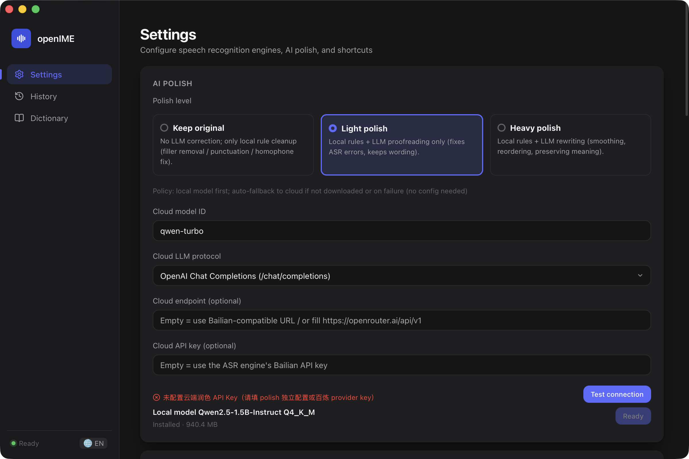
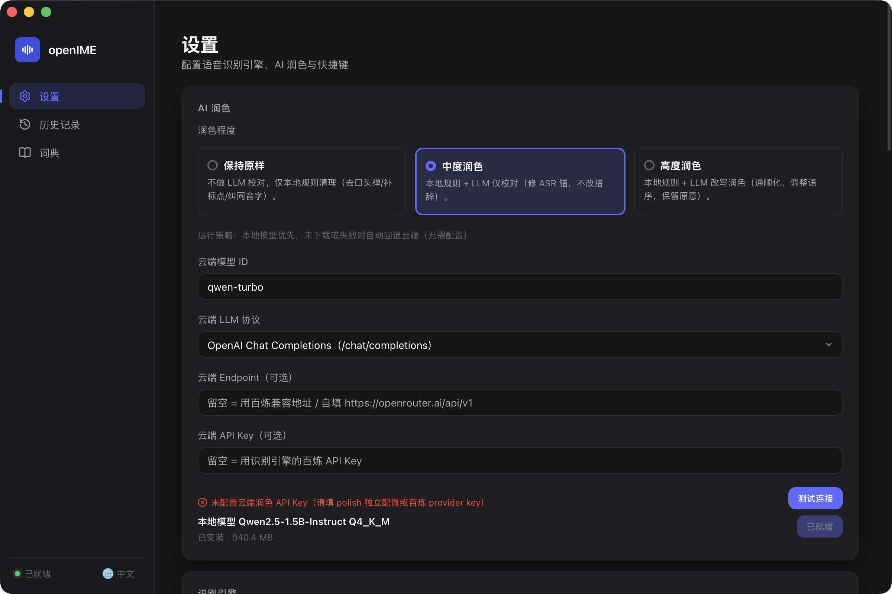
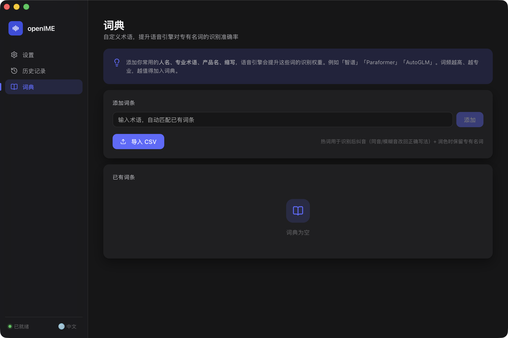
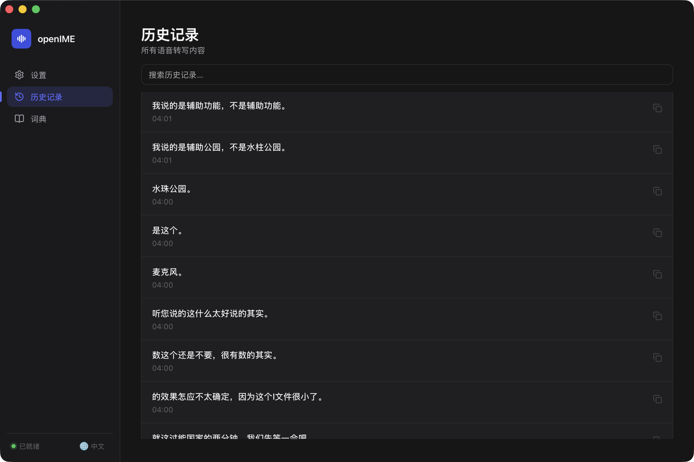

# openIME 用户指南

面向最终用户。开发者文档见 [development.md](./development.md)，排障见 [troubleshooting.md](./troubleshooting.md)。

---

## 安装（macOS）

1. 从 [Releases](../releases) 下载 `.dmg`，把 openIME 拖进 `/Applications`。
2. 首次打开：**右键 → 打开**（内测包未公证）。
3. 进入 **设置 → 系统权限**，授权 **麦克风** 与 **辅助功能**。

> 同一签名重装一般不必重新授权；若失效见 [troubleshooting.md](./troubleshooting.md)。

---

## 把语音变成文字（核心用法）

1. 确保引擎已配置（见下节）并点 **保存设置**。
2. 把光标点到任意可输入位置（文档、聊天框、搜索栏……）。
3. 按 **Fn（🌐 键）** 开始说话，再按一次停止。
4. 识别结果会**逐字输入到光标处**，录音结束后可能再被 AI 润色一次。

---

## 切换中 / 英界面

点**左下角 🌐 按钮**，在中文 ↔ 英文间循环切换，刷新后保持。

> 界面语言与**识别语言**相互独立。识别语言在「设置 → 识别引擎 → 默认语言」单独设置。

---

## 选择识别引擎

设置 → 识别引擎：

| 引擎 | 何时用 |
|---|---|
| **本地 sherpa-onnx**（推荐） | 注重隐私 / 离线；首次需点「下载」装模型 |
| **百炼 WebSocket 流式** | 云端逐字上屏，需 API Key |
| **OpenAI 兼容 REST** | 兼容 Whisper / OpenRouter 等 |
| **Multimodal REST** | 百炼 Qwen3 ASR 非流式 |

云端档填控制台地址即可，应用自动归一为正确端点。

---

## 用热词提升专有名词识别

**词典** 页：

- 添加常用**人名、术语、产品名、缩写**。
- 作用：识别后自动纠音（同音 / 模糊音改回正确写法）；润色时保留这些写法。
- 支持 **导入 CSV** 批量添加。

---

## AI 润色

设置 → AI 润色，三档：

- **保持原样**：仅本地规则清理（去口头禅、补标点、纠同音字）。
- **中度**：规则 + LLM 仅校对（修 ASR 错，不改措辞）。
- **高度**：LLM 改写润色；可选**风格包**（自定义 system prompt，F1 快捷键切换）。

策略：本地模型优先，未下载或失败自动回退云端，双失败则原文直出（不报错）。

---

## 文件转字幕

设置 → 文件转录 → **选择音频文件转录** → 生成文本 + **导出 SRT 字幕**。

---

## 快捷键

设置 → 快捷键：

- **录音快捷键**：默认 `Fn`，可改组合键（如 `Alt+Shift+D`）。
- **触发模式**：切换（按一次开 / 再按停）或 **按住说话**（PTT，松开停）。
- **风格包切换**：可选，如 `Ctrl+Shift+P`。

> 用 Fn 键需在 **系统设置 → 键盘 →「按下 🌐 键时」** 选「不执行任何操作」，否则系统会拦截。

---

## 历史

**历史记录** 页：按天分组，支持搜索、复制单条、按天删除。所有转写内容自动留存。

---

## 常见问题

| 现象 | 处理 |
|---|---|
| 按 Fn 没反应 | 确认引擎已配置并**保存设置**；确认权限已授权；Fn 被拦截则改组合键 |
| 识别不准 | 加热词；选更准的引擎 / 模型；开启 AI 润色 |
| 授权反复失效 | 用 `./scripts/build.sh install` 重装（固定签名），见 [troubleshooting.md](./troubleshooting.md) |
| 麦克风无声 | 设置 → 音频，换设备并点「测试」 |

更多排障与日志位置见 [troubleshooting.md](./troubleshooting.md)。
